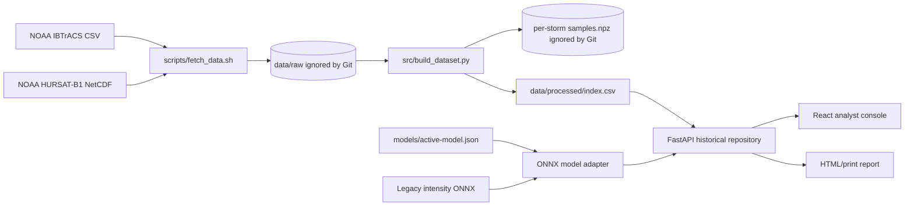
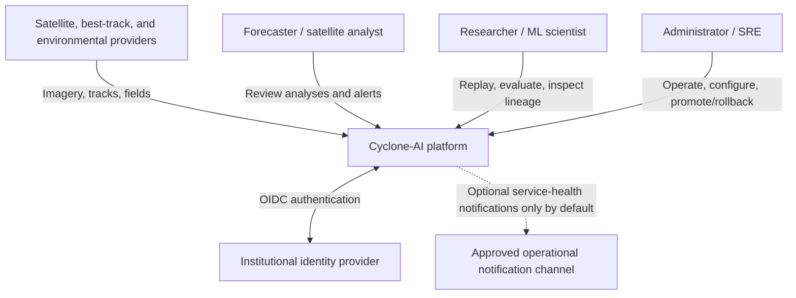
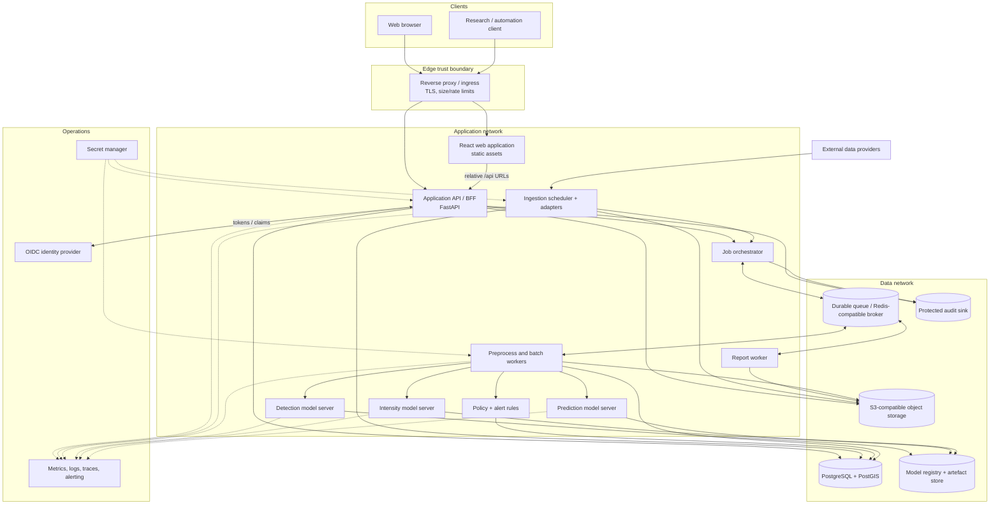
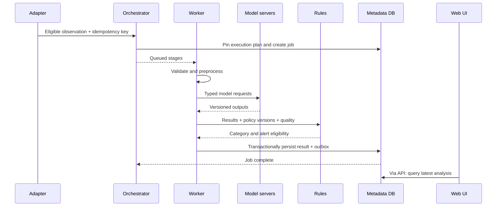
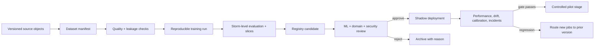

# Cyclone-AI Architecture Document

| Document field | Value |
|---|---|
| Document ID | CAI-ARC-001 |
| Version | 1.0 |
| Status | Proposed target architecture; current-state gaps identified |
| Date | 23 August 2026 |
| Related requirements | [PRD](PRD.md), [SRS](SRS.md) |
| Primary audience | Software, ML, data, platform, security, QA, and technical reviewers |

> This is a reference architecture, not a claim of an operationally deployed system. The repository contains a working single-process demonstration vertical slice (dataset builder, historical API/UI, manifest-driven legacy ONNX inference, reports, tests, and container packaging). Target live-source, durable, identity, detection/prediction, and pilot components remain subject to architecture, scientific, security, and domain review.

---

## 1. Purpose and scope

This document describes the technical architecture for Cyclone-AI, an AI-assisted tropical cyclone analysis platform. It covers:

- architectural drivers and constraints;
- current and target states;
- system context, containers, and component boundaries;
- ingest, inference, product, and ML lifecycle data flows;
- storage and canonical data design;
- model-serving design;
- security, privacy, reliability, observability, and scaling;
- deployment topologies and evolution path; and
- architectural decisions and open questions.

It does not define official meteorological operating procedures or claim model performance. Product intent is in the PRD; normative software behaviour is in the SRS; operational procedures are in the deployment guide.

---

## 2. Architectural drivers

### 2.1 Highest-priority drivers

| Driver | Architectural consequence |
|---|---|
| Traceable scientific output | Immutable source objects and inference manifests; version every model, adapter, transformation, and policy |
| Large heterogeneous binaries | Store bytes/arrays in object storage; keep searchable metadata in PostgreSQL/PostGIS |
| Burst-oriented compute | Asynchronous jobs and independently scalable CPU/GPU workers |
| Human-in-the-loop safety | Machine inference is immutable; review is a separate append-only event stream |
| Partial and stale sources | Explicit data-quality states and graceful degradation, never implicit “all clear” |
| Sensor and era shift | Source adapters, input signatures, slice metrics, drift monitoring, and abstention |
| Restricted deployment environments | Relative browser URLs, self-hostable components, offline maps/models, no mandatory runtime SaaS |
| Reproducible ML evaluation | Storm-level data manifests, immutable artefacts, baseline pipelines, registry approval gates |
| Small initial team | Start as a modular application/control plane plus workers; avoid premature microservice sprawl |
| Security before pilot | OIDC/RBAC, scoped identities, secret manager, signed/digested artefacts, immutable audit |

### 2.2 Quality-attribute scenarios

1. **Provider retry:** a provider delivers the same file twice. The second delivery resolves to the existing source object and creates no duplicate inference or alert.
2. **Provider correction:** bytes change at the same provider key. A new revision is retained; prior analyses still resolve their original checksum.
3. **Model rollback:** a newly deployed intensity model exhibits shift. An administrator routes new jobs to the prior immutable version while historical results remain unchanged.
4. **Worker loss:** a GPU worker dies mid-inference. The lease expires, retry creates no duplicate alert, and the original failed attempt remains observable.
5. **Optional feed outage:** ERA5 is unavailable. Browsing remains functional; prediction either uses its approved degraded path or abstains with a reason.
6. **Restricted network:** the platform runs without public internet at runtime using mirrored images, bundled model artefacts, and offline/approved map tiles.
7. **Forensic replay:** an auditor resolves an analysis to source hashes, preprocessing, code revision, model digest, configuration, and policy versions.
8. **UI source failure:** imagery cannot load. The UI retains last-known metadata, labels imagery unavailable/stale, and does not suggest no storm exists.

---

## 3. Current-state architecture

The repository now implements a demonstration vertical slice while retaining the batch data foundation:



`src/build_dataset.py` parses HURSAT filenames, time-matches an IBTrACS track, reads `IRWIN`, normalises a 301 × 301 image to `uint8`, and writes samples and labels. `app/` exposes that committed historical index and the active model through relative `/api/v1` contracts. `web/` provides replay, map/chart, upload, provenance, model-control, report, and alert-review experiences. The active model is selected through a checksum-pinned JSON manifest so a future validated ONNX model can replace the legacy checkpoint without changing API consumers.

### 3.1 Current-state strengths

- Raw and large per-storm tensors are excluded from Git while the promoted 4.8 MB demo ONNX artefact is checksum pinned.
- Download, transformation, model-format conversion, API serving, frontend build, testing, and container execution are scriptable.
- Input labels and historical imagery are paired without manual frame annotation.
- Sample metadata include storm, time, satellite, intensity, position, and category.
- FastAPI serves one versioned relative-URL contract and the production React bundle from a single origin.
- The model boundary is manifest-driven: artefact, digest, input dimensions, colour order, scaling, output, provenance, and validation state are externalised.
- Tests cover policy boundaries, historical derivation, model integrity/preprocessing/determinism, upload errors, alert transitions, and reports.

### 3.2 Current-state limitations

- Only one demonstrated replay storm exists; there is no multi-storm training manifest or storm-disjoint evaluation.
- The bundled legacy CNN has no published held-out evaluation or calibrated uncertainty and is not approved beyond demo use.
- Filename parsing and `IRWIN` assumptions in the historical builder remain HURSAT-specific.
- Wind-source preference and category mapping require meteorological review despite being centralised/versioned in the application.
- Multiple satellite views at one valid time may introduce near-duplicate training samples unless controlled.
- No validated broad-area detection or temporal prediction model is present; forecast/RI views use explicit past-only baselines.
- Alert review is process memory; no durable queue/database/object store, institutional identity, protected audit, live-source scheduler, or pilot observability exists.
- Docker/Compose packaging exists, but CI/CD and production infrastructure automation remain target state.

---

## 4. Target system context



### 4.1 System boundary

Inside the Cyclone-AI boundary:

- source acquisition/adapters;
- scientific preprocessing and canonical metadata;
- inference orchestration and model serving;
- metadata, binary object, model, and audit persistence;
- analyst API and web application;
- alert rules, report generation, and monitoring integration.

Outside the boundary:

- provider systems and their data quality/availability;
- authoritative meteorological warning processes;
- identity-provider account lifecycle;
- infrastructure control planes supplied by the selected host;
- downstream official dissemination.

---

## 5. Target container architecture



### 5.1 Why this shape

The control plane begins as a **modular monolith** exposed by one application API, while expensive or long-running work runs in workers. This keeps transactions, authorisation, and the initial team’s operational burden manageable. Model servers are separate processes/containers because their dependencies and scaling profiles differ. Components may be split into independently deployed services later only when load, ownership, security, or release cadence justifies it.

The browser calls relative `/api` paths. In development and deployment, the frontend server or ingress proxies those paths to the API. Browser code never calls `localhost` to reach a backend.

---

## 6. Component responsibilities

### 6.1 Web application

**Responsibilities**

- operations overview, storm detail, historical replay, upload, alert, report, and system-status experiences;
- map/chart rendering and accessible table equivalents;
- optimistic-free state changes for review actions (server confirmation required);
- mode, valid-time, staleness, uncertainty, and provenance display;
- authenticated session interaction via the approved edge pattern.

**Does not**

- decide access, category, alert eligibility, or scientific transformations;
- embed model thresholds or category boundaries;
- connect directly to database, queue, model server, or object storage using broad credentials.

### 6.2 Application API / backend-for-frontend (BFF)

**Modules within the initial application**

- `identity` — map verified claims to local roles/permissions;
- `storms` — storm/candidate query and association views;
- `analyses` — result aggregation and provenance;
- `jobs` — asynchronous submission, status, cancellation;
- `alerts` — query and append-only transitions;
- `reviews` — append analyst dispositions;
- `reports` — generation requests and download authorisation;
- `models` — safe metadata and governed stage transitions;
- `status` — freshness/dependency/version summary;
- `audit` — mandatory event publication.

The API owns user-facing resource contracts and authorisation. It does not perform GPU inference in request threads.

### 6.3 Ingestion scheduler and adapters

- Discover provider objects by time window/cursor.
- Fetch through bounded retries and provider-specific authentication.
- Stream bytes into quarantine object storage while hashing.
- Validate structure, scientific variables, geospatial/time bounds, and licence metadata.
- Emit canonical observations and manifests.
- Schedule eligible preprocessing/inference idempotently.
- Report lag, last success, rate-limit state, and safe errors.

Adapter packages depend on the canonical domain interface, not vice versa. Provider-specific variable names and credentials remain inside the adapter.

### 6.4 Job orchestrator

- Validate and pin an execution plan at acceptance.
- Generate idempotency/deduplication keys.
- Enqueue stages and manage dependency graph/timeouts.
- Track attempts and terminal status.
- Apply retry class by error code (transient/permanent/quality).
- Finalise immutable inference manifests and emit audit/telemetry.

A workflow can include:

```text
validate → canonicalise → preprocess → detect → associate → crop
         → intensity → sequence/features → predict → RI policy
         → persist → optional alert → optional report
```

Historical storm-centred samples may start at `preprocess` or `intensity`; broad-area scenes start at `detect`.

### 6.5 Preprocessing and batch workers

- Decode NetCDF/HDF/approved raster formats in a resource-limited process.
- Calibrate and convert channels according to source profile.
- Reproject/regrid where required.
- Create storm-centred tensors, masks, and environmental features.
- Write content-addressed derived artefacts and manifest entries.
- Submit typed model requests and validate typed responses.

Scientific transforms should be pure functions where practical, with explicit configuration and golden fixtures.

### 6.6 Model servers

Each model server:

- loads one or a small bounded set of approved model versions at startup;
- validates input signature and model artefact digest;
- performs batched inference within resource/time limits;
- returns numerical output plus model/runtime metadata;
- exposes liveness, readiness, and metrics;
- has no ability to promote itself, write policy, or create alerts.

Model servers SHOULD be stateless. Model artefacts are delivered with or mounted into an immutable deployment; a mutable “latest” path is prohibited for pilot deployments.

### 6.7 Policy/category/alert module

This module is deterministic and independently tested. It owns:

- wind/category profile lookup;
- uncertainty/category ambiguity derivation;
- RI event definition and operating threshold;
- freshness, lifecycle, DQ, cooldown, and mode eligibility;
- stable alert deduplication keys; and
- policy version resolution.

Separating this from model inference allows scientific probabilities to be recalibrated or policies to change without hiding the history of either.

### 6.8 Report worker

- Reads an immutable analysis snapshot and approved template version.
- Renders PDF/HTML and machine-readable JSON manifest.
- Embeds disclaimer, attributions, versions, valid times, uncertainty, and DQ.
- Stores reports as immutable objects with checksums.
- Uses a sandboxed renderer with no unrestricted network access.

### 6.9 Metadata database

PostgreSQL is the system of record for queryable entities and workflow state. PostGIS supports footprints, centre points, tracks, and geodesic/spatial queries.

Examples stored in the database:

- source-object and observation metadata;
- storms, aliases, track fixes, detections;
- analyses, module results, forecasts, quality status;
- policy/model metadata references;
- jobs and attempts;
- alerts and reviews;
- object URIs/checksums (not large arrays themselves);
- outbox records for reliable events/audit publication.

### 6.10 Object storage

S3-compatible object storage contains:

```text
raw/<provider>/<yyyy>/<mm>/<dd>/<content-sha256>.<ext>
canonical/<observation-id>/<transform-version>/<content-sha256>.<ext>
features/<feature-set-version>/<storm-id>/<valid-time>/<hash>.*
models/<model-name>/<model-version>/<digest>/*
reports/<yyyy>/<mm>/<report-id>/<digest>.*
manifests/<yyyy>/<mm>/<manifest-id>.json
quarantine/<provider>/<ingest-id>/*
```

Keys are illustrative. Access is by scoped service identity or short-lived signed URL. Provider credentials and personal names are never embedded in keys.

### 6.11 Queue/broker

The reference architecture requires durable delivery, visibility timeouts/leases, retry/dead-letter support, and separate priority classes. A Redis-compatible implementation may suit the prototype; a managed queue or message broker may replace it for a pilot without changing domain contracts.

Queues SHOULD be separated by workload:

- `ingest` — provider/canonicalisation;
- `interactive-inference` — analyst-triggered work;
- `automatic-inference` — incoming observations;
- `replay-batch` — low-priority historical work;
- `reports`;
- `dead-letter`/quarantine.

### 6.12 Registry and experiment tracking

The model registry records immutable artefact digest, input signature, training dataset manifest, code revision, metrics/slices, model card, approval, and stage. MLflow or an equivalent may be used, but the application consumes a small internal registry interface to avoid coupling business logic to a vendor API.

---

## 7. Principal data flows

### 7.1 Historical dataset construction

```mermaid
sequenceDiagram
    participant S as Dataset source
    participant A as Source adapter
    participant O as Object storage
    participant P as Preprocessor
    participant D as Metadata DB
    participant M as Dataset manifest

    A->>S: Discover/fetch source object
    A->>A: Stream hash + structural validation
    A->>O: Put immutable raw object
    A->>D: Upsert source metadata (idempotent)
    A->>P: Canonicalise/preprocess request
    P->>O: Read raw object by digest
    P->>O: Write derived tensor/feature by digest
    P->>D: Write observation + quality + lineage
    P->>M: Append sample reference (immutable version)
    M->>M: Group split by storm; run leakage checks
```

Dataset manifests point to artefacts; they do not copy multi-gigabyte arrays into Git. A small fixture manifest MAY be committed when licensing permits.

### 7.2 Automatic observation-to-analysis



Implementation uses the API rather than direct UI→DB access; the sequence shortens that read path for clarity.

### 7.3 Alert creation and review

1. Rules emit an `AlertCandidate` with deterministic deduplication key.
2. Application transaction inserts an alert only if no active equivalent exists and writes an outbox/audit record.
3. UI retrieves alert with exact valid time, trigger, threshold, horizon, analysis, and DQ.
4. Analyst action calls a transition command with expected current version.
5. Server verifies role and state, appends `ReviewEvent`, updates materialised alert state, and writes audit outbox in one transaction.
6. Optional external notification consumes approved outbox events. It cannot mutate inference.

Optimistic concurrency (`version`/ETag) prevents two reviewers from silently overwriting alert state.

### 7.4 Forensic replay

An `InferenceManifest` resolves:

```text
analysis_id
 ├── mode and requested-by/service identity
 ├── source object IDs + SHA-256 + valid times
 ├── canonical/derived object IDs + hashes
 ├── adapter/preprocessing package + code revision + parameter hash
 ├── model registry IDs + artefact digests + runtimes
 ├── policy/category/RI versions
 ├── random/determinism settings and hardware/runtime metadata
 ├── module outputs + warnings + quality codes
 └── execution attempts + correlation/trace IDs
```

Reproduction creates a new analysis linked by `reproduces_analysis_id`; it never overwrites the original.

---

## 8. Storage and consistency design

### 8.1 Data placement

| Data | Store | Rationale |
|---|---|---|
| NetCDF/HDF/raster, tensors, overlays, reports, manifests | Object storage | Large immutable bytes, lifecycle rules, checksums |
| Storms, tracks, observations, results, jobs, reviews | PostgreSQL/PostGIS | Transactions, relational queries, geospatial indexing |
| Ephemeral cache/rate limit/short queue | Redis-compatible store | Low latency and TTL semantics; not sole scientific record |
| Model metadata | Registry + DB reference | Governed lifecycle and model-centric queries |
| Model binaries | Immutable object/OCI artefact store | Digest-addressed delivery |
| Audit | Protected database/sink plus archive | Append-only access and longer retention |
| Metrics/logs/traces | Observability backend | Operational query and alerting |

### 8.2 Consistency rules

- Database transaction owns metadata state transitions.
- Object bytes are written and checksum-verified before metadata is marked available.
- Failed orphan object writes are garbage-collected after a safety window.
- Database rows store object digest and URI; consumers verify digest on sensitive paths.
- Event/audit publication uses a transactional outbox to avoid “DB committed but event lost.”
- User-facing list/detail reads may use cache, but provenance and state transitions read authoritative storage.
- No distributed transaction is attempted across object store, model server, and DB; jobs use idempotent saga-style stages.

### 8.3 Suggested relational aggregates

The exact schema is implementation-owned, but likely bounded contexts include:

- `catalog`: source_objects, source_revisions, observations, quality_checks;
- `meteorology`: storms, storm_aliases, track_fixes, storm_associations;
- `analysis`: analyses, detections, intensity_estimates, forecasts, ri_estimates, manifestations;
- `workflow`: jobs, job_attempts, idempotency_keys, outbox;
- `operations`: alerts, review_events, reports;
- `governance`: model_versions, policy_versions, approval_events, audit_refs.

Partition high-volume time-series tables by valid-time range only after query/load evidence justifies it. Index commonly on `(storm_id, valid_time)`, source/provider keys, analysis ID, job state/created time, alert state/severity, and geospatial geometry.

---

## 9. ML architecture

### 9.1 Detection module (M1)

**Target input:** calibrated, georeferenced broad-area infrared scene plus valid-time/geometry metadata.

**Candidate approach:** YOLOv8-class detector for the prototype; RetinaNet or other architecture can be evaluated behind the same contract.

**Output:** zero or more bounding geometries, centre coordinates transformed back to WGS 84, scores, and quality warnings.

**Key controls**

- Boxes auto-generated from historical best-track centres require explicit box-size/visibility policy and spot checking.
- Negative scenes and pre-/post-storm lifecycle periods are essential.
- Test split is by storm and scene; nearby frames must not leak.
- Centre error uses geodesic distance; detection matching policy is fixed before evaluation.
- “Cyclogenesis” candidates remain experimental until event-based prospective validation.

### 9.2 Intensity module (M2)

**Target input:** source-compatible storm-centred IR tensor (prototype: 301 × 301) plus mask/metadata as declared by model signature.

**Candidate approach:** ResNet-18 or EfficientNet backbone with regression/quantile heads. Vmax regression remains separate from deterministic category mapping.

**Recommended outputs**

- central Vmax estimate;
- calibrated interval or quantiles;
- optional cloud-pattern head only with approved labels;
- optional saliency/evidence map generated asynchronously;
- abstention/OOD score where validated.

**Key controls**

- Preserve brightness temperature convention; do not hide sensor-specific normalisation.
- Rotational augmentation may be meteorologically plausible but is documented and validated.
- Multi-satellite observations at one valid time need grouping/weighting to avoid leakage and bias.
- Labels must retain source and averaging period.
- Category boundaries belong to policy, not learned weights.

### 9.3 Prediction module (M3)

**Target input:** last 4–8 approved IR frames or declared temporal window, current/history intensity, location/time, and available environmental features (for example shear, SST, humidity).

**Candidate approach:**

- baseline: persistence and tabular gradient-boosted model;
- sequence path: CNN encoder + GRU/ConvLSTM;
- tabular path: normalised environmental/history features;
- fusion head: multi-horizon intensity change and RI probability;
- calibration: held-out validation storms, separate artefact/version.

**Outputs:** 6/12/24-hour estimate or change, uncertainty, RI probability, input/missingness manifest.

**Key controls**

- The more complex model is not promoted unless it beats persistence on untouched storms.
- Future environmental reanalysis cannot leak into operationally available features; training should use availability-aware cutoffs.
- Missingness is explicit; silent interpolation is prohibited.
- RI uses event-based, imbalance-aware metrics and calibrated probabilities.

### 9.4 Experimental track module

If implemented, track nowcast is isolated behind an `experimental` contract. It may use recent motion extrapolation and deep-feature motion for 12–24 hours, but is not presented as NWP-equivalent guidance. It has a separate uncertainty geometry and can be disabled independently.

### 9.5 ML lifecycle



Model monitoring separates:

- **system metrics:** latency, errors, GPU memory, queue age;
- **input metrics:** source mix, temperature distribution, missingness, OOD score;
- **output metrics:** estimate/category/probability distribution and abstention;
- **delayed quality metrics:** error/calibration after reference truth becomes available;
- **workflow metrics:** alert volume, acknowledgements, dismiss reasons.

No drift metric automatically changes an operational model unless a separately approved policy allows it.

---

## 10. API and integration architecture

The API follows resource-oriented HTTP under `/api/v1` as detailed in the SRS. Important patterns:

- async create returns `202 Accepted`, job URL, and idempotency status;
- errors use stable machine codes and safe human detail;
- cursor pagination avoids expensive page offsets;
- immutable resources use strong ETags where possible;
- transitions are commands/resources, not arbitrary patching of immutable records;
- OpenAPI/JSON Schema is contract-tested;
- binary access uses authorised streaming or short-lived signed URLs;
- versioning policy distinguishes additive compatible changes from breaking `/v2` changes.

### 10.1 Event contracts

Internal events are versioned envelopes:

```json
{
  "event_id": "evt_...",
  "event_type": "analysis.completed",
  "schema_version": "1.0",
  "occurred_at": "2026-08-23T14:30:00Z",
  "producer": "analysis-worker",
  "correlation_id": "corr_...",
  "subject": "analysis/ana_...",
  "data": {}
}
```

Consumers ignore unknown additive fields. Poison events move to dead-letter after bounded attempts. Broker delivery is at least once; handlers are idempotent.

---

## 11. Security architecture

### 11.1 Trust zones

1. **Untrusted external:** browsers, provider endpoints, user uploads.
2. **Edge:** TLS termination, web application firewall controls where available, request/rate/size limits.
3. **Application:** API, scheduler, workers; no public direct access.
4. **Model compute:** model servers with narrowly scoped read access to approved artefacts; no general internet required.
5. **Data:** database, object store, queue, registry, audit; network and identity restricted.
6. **Management:** CI/CD, secret manager, monitoring, infrastructure control plane; highest privilege and separate access.

### 11.2 Identity and authorisation

- Institutional OIDC is preferred for shadow/pilot.
- Edge/API validate issuer, audience, expiry, nonce/state as applicable, and key rotation.
- API maps claims/groups to explicit permissions; it never trusts a role supplied in request JSON.
- Service identities are distinct per component with scoped permissions.
- Administrative/model-promotion actions require stronger role and complete audit.
- Short-lived signed object URLs are bound to object, operation, and expiry.

### 11.3 Threat analysis highlights

| Threat | Example | Principal controls |
|---|---|---|
| Spoofing | Forged user/service or provider object | OIDC, workload identity, TLS, checksums/provider metadata |
| Tampering | Replaced model or modified analysis | Artefact digests/signatures, immutable storage, DB permissions, audit |
| Repudiation | User disputes alert dismissal | Authenticated append-only review/audit with UTC and correlation ID |
| Information disclosure | Secrets in logs/signed URLs | Redaction, scoped URLs, secret manager, access review |
| Denial of service | Huge upload/replay storm | Edge limits, parser sandbox, quotas, priority queues, backpressure |
| Elevation of privilege | Viewer promotes model | Server-side RBAC, separate admin endpoint/role, approval workflow |
| Scientific supply chain | Poisoned data/dependency | Provenance, checksums, dataset review, lockfiles, SBOM/scanning |
| Parser exploit | Crafted NetCDF/archive | Allowlist, decompression limits, non-root sandbox, patched libraries |

A full data-flow threat model is required before external exposure.

### 11.4 Security invariants

- No credentials in source control, container layers, URLs, reports, or model packages.
- No public database, object-store, queue, registry, or model-server endpoint.
- Runtime containers do not require a Docker socket or host filesystem.
- Upload workers cannot access production secrets unrelated to upload processing.
- User-provided strings are escaped in HTML/PDF and neutralised in spreadsheet exports.
- Security/audit clocks are synchronised and monitored.

---

## 12. Reliability and failure design

### 12.1 Failure classification

| Class | Examples | Behaviour |
|---|---|---|
| Permanent input | Unsupported channel, corrupt georeference | Quarantine/fail without blind retry |
| Transient provider | Timeout, rate limit, 5xx | Exponential backoff with jitter and bounded attempts |
| Transient platform | Worker loss, temporary DB/network failure | Lease expiry/retry with idempotency |
| Resource | OOM, oversized file, GPU unavailable | Fail safely, report code, optionally route approved smaller profile |
| Scientific quality | Excessive missingness, stale frame, OOD | Abstain/degrade according to policy |
| Partial module | Explanation fails after intensity succeeds | Persist partial analysis and label affected module |
| Policy/compatibility | Model signature does not match preprocessor | Readiness fails; deployment blocked or job rejected |

### 12.2 Resilience patterns

- timeouts on every external/dependency call;
- bounded retry only for classified transient errors;
- circuit breaker/provider backoff to prevent retry storms;
- idempotency keys and unique constraints;
- queue visibility timeout exceeding expected job duration with heartbeat/lease extension;
- transactional outbox for events/audit;
- separate interactive and batch capacity;
- liveness for deadlock recovery and readiness for dependency/model compatibility;
- graceful shutdown to stop leasing and complete/requeue in-flight work;
- immutable result creation and attempt linkage.

### 12.3 Degraded modes

| Failure | Still available | Suppressed/labelled |
|---|---|---|
| New satellite feed unavailable | Historical/last-known analysis browsing | Fresh analysis and dependent alerts; stale banner |
| Environmental feed unavailable | Detection/intensity if signatures permit | Prediction or approved degraded prediction |
| Detection server unavailable | Known-storm centred historical analysis if inputs exist | Broad-scene candidate detection |
| Prediction server unavailable | Detection/intensity/history | Forecast and RI; explicit unavailable state |
| Object imagery unavailable | Metadata and prior numerical result | Image/evidence panel; provenance notes object error |
| Identity provider unavailable | Existing short session per security policy or internal health only | New login and state-changing actions as configured |
| Database unavailable | Health endpoints/limited static shell | Analytical queries and writes; no cached false current state |

---

## 13. Observability architecture

### 13.1 Telemetry standards

OpenTelemetry-compatible instrumentation is preferred. Every job/request propagates `trace_id`/`correlation_id` across API, queue envelope, workers, model servers, DB, and safe logs.

**Metrics**

- API RED: request rate, errors, duration;
- worker USE: utilisation, saturation, errors;
- queue depth, oldest age, throughput, retries, dead letters;
- provider discovery lag, fetch failures, last valid observation;
- DQ outcomes by low-cardinality reason/source;
- inference latency/error/abstention by model version;
- alert creation/deduplication/status counts;
- object/database latency and capacity;
- delayed model quality/calibration dashboards.

**Logs**

Structured JSON with UTC, environment, service, version, level, safe event code, trace/correlation ID. Raw tokens, signed URLs, full user files, and secrets are prohibited. Storm/job/user IDs should be log fields only when needed and protected; they are not unbounded metric labels.

**Traces**

Sample normal traffic; retain errors and slow jobs at higher rates. Scientific manifest is not replaced by a trace—both serve different retention and integrity needs.

### 13.2 SLOs and alerts

Initial shadow-mode objectives:

- application availability 99.5% monthly;
- p95 metadata API ≤ 500 ms under reference load;
- p95 observation-to-result ≤ 5 minutes excluding upstream delay;
- source freshness thresholds per adapter;
- dead-letter count and oldest queue age within approved bounds.

Page only on user-impacting/actionable conditions. Ticket lower-severity drift/capacity trends. Every operational alert links to a runbook and has an owner.

---

## 14. Performance and scalability

### 14.1 Scaling dimensions

| Dimension | Scaling method |
|---|---|
| Browser/API reads | Stateless API replicas, DB indexes/read cache, CDN/static caching where allowed |
| Provider ingestion | Adapter-level concurrency bounded by provider rules |
| CPU preprocessing | Horizontal worker replicas by queue depth/age |
| GPU inference | Model-specific worker/server replicas, batching, GPU node pool |
| Historical replay | Low-priority queue, quotas, scheduled capacity |
| Object volume | Lifecycle tiers, content addressing, compression/chunking such as Zarr where appropriate |
| Metadata time series | Correct indexes, bounded queries, later range partitioning if measured |
| Maps/tiles | Approved tile cache/service; no dependency on uncontrolled public rate limits |

### 14.2 Performance protections

- no broad object listing on interactive paths;
- no raw arrays returned as JSON;
- tile or downsample large imagery for web delivery;
- compute expensive explanation overlays asynchronously and cache by input/model digest;
- precompute storm timeline summaries;
- enforce upload, time-window, concurrency, and replay quotas;
- batch model requests only within a bounded latency budget;
- keep model warm and validate readiness after load.

### 14.3 Capacity worksheet

Before each environment is sized, record:

- source scenes/hour and peak burst;
- average/p95 raw and derived object size;
- model count, memory, CPU/GPU inference duration;
- expected active storms and timeline records;
- concurrent users and historical jobs;
- retention and annual growth;
- RTO/RPO and replica requirements.

Sizing without these inputs is explicitly provisional.

---

## 15. Deployment topology

### 15.1 Local development

- Python environment for existing scripts and future API/workers.
- Container Compose profile for PostgreSQL/PostGIS, object store, queue, and observability development dependencies when implemented.
- Frontend development server proxies `/api` to the API and binds `0.0.0.0` when remote preview is needed.
- Local fixture provider replaces external downloads in tests.
- No production credentials or data required for unit/contract tests.

### 15.2 Demonstration environment

A small single-node or managed container deployment may host web/API/worker plus external managed stores. One process may combine control-plane modules, but data boundaries, manifests, and async work remain. Authentication can use an approved demo profile only if access is restricted and clearly non-operational.

### 15.3 Shadow/pilot reference

- Kubernetes or equivalent orchestrator across at least two failure domains where available.
- Separate namespaces/projects/accounts per environment.
- Ingress/TLS and OIDC.
- Stateless web/API replicas.
- CPU worker pool and optional tainted GPU pool.
- Managed PostgreSQL/PostGIS preferred, versioned S3-compatible object storage, durable broker.
- Private networking for data/model components.
- GitOps/Helm or equivalent declarative release with immutable image digests.
- Central telemetry, secret manager, backup, and policy controls.

See [DEPLOYMENT.md](DEPLOYMENT.md) for delivery and runbooks.

---

## 16. Proposed repository evolution

A future monorepo layout could be:

```text
apps/
  api/                 # FastAPI application/BFF
  web/                 # React/TypeScript UI
services/
  ingest/              # scheduler and source adapters
  worker/              # workflows and scientific preprocessing
  model-serving/       # detection/intensity/prediction entrypoints
packages/
  contracts/           # OpenAPI/JSON Schema/event schemas
  domain/              # units, policy types, state machines
  scientific/          # pure transformations and geospatial utilities
  observability/
ml/
  datasets/            # manifest builders, checks, split logic
  training/            # model-specific training entrypoints
  evaluation/          # baselines, metrics, slices, reports
infra/
  compose/
  helm/
  terraform/           # only if selected
migrations/
tests/
  fixtures/
  contract/
  integration/
  e2e/
docs/
```

This remains an evolutionary proposal rather than a required immediate move. The current builder now shares category policy with the application and has safer directory/index handling; source-specific decoding and scientific transformations can be extracted behind golden adapter tests as the dataset expands.

---

## 17. Evolution plan

### Phase A — Reproducible data foundation

1. Pin dependencies and add test tooling.
2. Define source/observation/dataset manifest JSON Schemas.
3. Add checksums, licence/source metadata, quality codes, and golden fixtures.
4. Separate HURSAT and IBTrACS adapters from scientific transforms.
5. Generate multi-storm, storm-disjoint split manifests and near-duplicate report.

### Phase B — Offline ML baseline

1. Implement persistence and simple intensity baselines.
2. Add training/evaluation run manifests and model cards.
3. Establish object/registry conventions.
4. Produce held-out-storm metrics and confidence intervals.

### Phase C — Application vertical slice

1. PostgreSQL/PostGIS, object store, queue, and migration baseline.
2. API contracts for storm, analysis, job, provenance, and health.
3. Async worker runs one historical intensity model.
4. UI historical replay and storm detail with all status states.
5. End-to-end reproducibility and report.

### Phase D — Full prototype

1. Detection and temporal prediction services.
2. RI policy/alert/review workflow.
3. GridSat/ERA5 and then INSAT adapters.
4. Model registry promotion gates and slice/drift dashboards.
5. Accessibility, security, load, and resilience tests.

### Phase E — Shadow readiness

1. Institutional identity/RBAC and protected audit.
2. Declarative infrastructure, backups, restore, rollback, and on-call runbooks.
3. Threat model and security remediation.
4. Shadow-mode domain validation and operating procedure.

---

## 18. Architecture decision records

The table records baseline decisions. Material changes should create standalone ADR files.

| ADR | Decision | Status | Rationale/consequence |
|---|---|---|---|
| ADR-001 | Begin with a modular control-plane application plus async workers, not many microservices | Accepted for baseline | Lower delivery/operations cost while preserving module boundaries |
| ADR-002 | Store large immutable bytes in object storage and searchable state in PostgreSQL/PostGIS | Accepted | Matches access patterns; avoids database blobs and filesystem coupling |
| ADR-003 | Split and evaluate datasets by storm | Accepted | Prevents frame-level leakage and inflated metrics |
| ADR-004 | Estimate continuous intensity, then derive category through versioned policy | Accepted | Smooth target, transparent boundaries, policy evolution |
| ADR-005 | Run inference/report/replay asynchronously | Accepted | Handles bursty long-running work and timeouts without blocking API |
| ADR-006 | Keep machine result immutable and append human review separately | Accepted | Preserves evidence, authority, and auditability |
| ADR-007 | Use UTC/RFC 3339, WGS 84, explicit units/averaging period | Accepted | Removes common scientific/integration ambiguity |
| ADR-008 | Use relative browser API paths behind one ingress | Accepted | Works in proxied/restricted environments and avoids browser localhost errors |
| ADR-009 | Package models by immutable digest with input signature and approval metadata | Accepted | Reproducible and safe deployment/rollback |
| ADR-010 | Keep alert decisions in a versioned rules layer outside model inference | Accepted | Separates calibrated risk from operating policy and workload trade-offs |
| ADR-011 | Prefer open/portable interfaces (S3, Postgres, OIDC, OpenAPI, OCI, OTel) | Accepted | Supports local, cloud, and restricted institutional deployment |
| ADR-012 | Use React/TypeScript + Leaflet and FastAPI/Python as the initial product stack | Proposed | Aligns with plan and team skills; confirm before implementation |
| ADR-013 | Select concrete queue/registry/orchestrator products after prototype load tests | Deferred | Avoid premature vendor lock; required capabilities are already specified |

---

## 19. Open architecture questions

1. Which INSAT products, channels, cadence, calibration metadata, and licence terms are approved?
2. What is the approved wind harmonisation and category policy, including averaging period?
3. Is the target network internet-connected, restricted, or air-gapped?
4. Which institutional OIDC groups map to analyst, research, admin, and approval roles?
5. Is GPU required for latency targets, and what accelerator family is available?
6. Which object store, queue, registry, and observability platforms are institutionally supported?
7. What raw/derived/audit retention and legal hold policies apply?
8. Is offline GIS tile hosting required, and what basemap is licensed?
9. What approval roles are required for model and scientific-policy promotion?
10. Are explanation maps allowed in operational views, and what user training/limitations are required?

---

## 20. Architecture fitness functions

The architecture is continuously checked by automated or review gates:

| Fitness function | Evidence |
|---|---|
| No same storm across dataset splits | CI manifest validator |
| Every retained analysis resolves complete lineage | Schema + referential integrity test |
| No browser code targets localhost in a release build | Static/config test |
| No large scientific binary committed to Git | Pre-commit/CI size and extension policy |
| Model input schema matches preprocessor output | Contract/golden deployment test |
| Duplicate delivery produces one logical analysis/alert | Idempotency integration test |
| Immutable records cannot be edited by normal roles | DB/API authorisation test |
| Optional feed loss produces explicit degraded state | Fault-injection end-to-end test |
| API compatibility is checked | OpenAPI diff and consumer contract tests |
| Restore meets declared RTO/RPO | Scheduled recovery exercise |
| Runtime images contain no critical accepted-unknown issues | SBOM and vulnerability policy gate |
| Critical UX is keyboard/screen-reader usable | Automated + manual accessibility evidence |

---

## 21. Review and approval

| Role | Decision | Name/date |
|---|---|---|
| Engineering/architecture lead | Pending | — |
| ML lead | Pending | — |
| Data lead | Pending | — |
| Meteorological reviewer | Pending | — |
| Security/platform reviewer | Pending | — |
| UX lead | Pending | — |

Architecture review is required when a trust boundary, source of truth, public interface, deployment model, scientific policy boundary, or state ownership changes.
