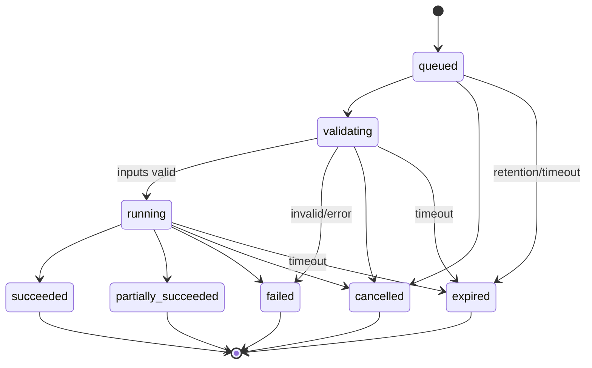
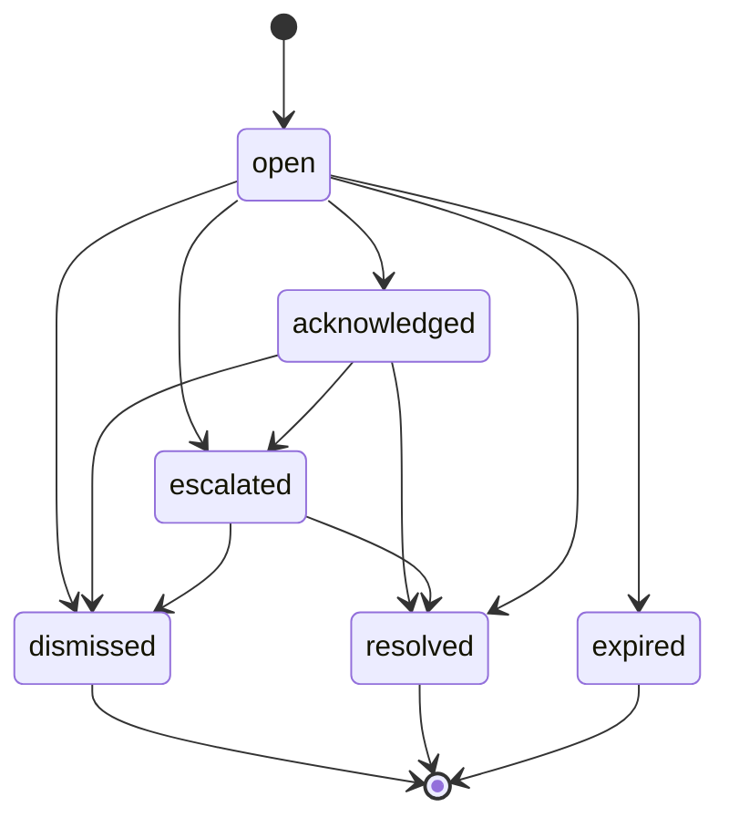

# Software Requirements Specification (SRS)

## Cyclone-AI

| Document field | Value |
|---|---|
| Document ID | CAI-SRS-001 |
| Version | 1.0 |
| Status | Target-state baseline for review |
| Date | 23 August 2026 |
| Product requirements source | [CAI-PRD-001](PRD.md) |
| Intended audience | Software, ML, data, QA, security, platform, UX, and meteorological reviewers |

> This SRS specifies the intended system, including components not yet implemented. At this revision, the repository implements an initial HURSAT–IBTrACS dataset-building script only. Requirement wording does not assert implementation or operational approval.

---

## 1. Purpose

This document translates the product intent for Cyclone-AI into testable software requirements. It defines system boundaries, interfaces, data contracts, functional behaviour, quality attributes, security controls, and verification criteria for a demonstration MVP, integrated prototype, and eventual controlled shadow-mode deployment.

Normative terms are used as follows:

- **SHALL** — mandatory for the stated release or deployment class.
- **SHOULD** — recommended; omission requires a recorded rationale.
- **MAY** — optional.
- **P0/P1/P2** — release priority from the PRD.

When a requirement applies only to a later deployment class, that condition is stated explicitly.

---

## 2. Scope

Cyclone-AI receives geospatial satellite observations and related meteorological data, creates canonical observations, executes versioned machine-learning inference, and presents cyclone candidates, intensity estimates, short-range intensity forecasts, rapid-intensification (RI) risk, evidence, and provenance to authorised users.

### 2.1 Included

- historical and approved near-real-time source adapters;
- data validation, normalisation, quality flags, lineage, and storage;
- broad-area cyclone candidate detection;
- storm-centred intensity regression and category derivation;
- 6-, 12-, and 24-hour intensity forecasting and RI probability;
- asynchronous inference orchestration;
- web dashboard, historical replay, upload analysis, reviews, alerts, and reports;
- model/data versioning, audit, monitoring, and operational controls.

### 2.2 Excluded

- official forecast/warning authorship or dissemination;
- long-range numerical track prediction;
- storm surge, flood, rainfall, damage, or evacuation modelling;
- public user registration and public-alert delivery;
- automatic model retraining/promotion without approval.

---

## 3. References

### 3.1 Project documents

- [Product Requirements Document](PRD.md)
- [Architecture Document](ARCHITECTURE.md)
- [UI/UX Specification](UI_UX.md)
- [Deployment and Operations Guide](DEPLOYMENT.md)
- [Original Technical Plan](PLAN.md)

### 3.2 External guidance

These are design references, not claims of certification:

- ISO/IEC 25010 quality model.
- ISO 8601 / RFC 3339 date and time representation.
- RFC 7946 GeoJSON.
- OpenAPI 3.1 for HTTP API description.
- WCAG 2.2 Level AA for user-interface accessibility.
- OWASP Application Security Verification Standard and OWASP API Security Top 10.
- NIST AI Risk Management Framework as a governance reference.

Dataset-specific licence and citation records SHALL be maintained with each adapter rather than inferred from this document.

---

## 4. Definitions and abbreviations

| Term | Definition |
|---|---|
| Analysis | A versioned set of machine outputs for a specific input observation/window |
| Canonical observation | Source-neutral metadata and object references produced by an adapter |
| Candidate | A model-detected system not necessarily confirmed as an official tropical cyclone |
| Category profile | Versioned mapping from wind intensity to approved meteorological labels |
| Centre fix | Estimated geospatial centre of a candidate/storm |
| DQ | Data quality |
| Inference manifest | Immutable record of inputs, checksums, code/model/config versions, and outputs |
| IR | Infrared satellite channel |
| NIO | North Indian Ocean |
| RI | Rapid intensification; event definition is versioned and configurable |
| Shadow mode | Near-real-time use where outputs are evaluated but not authoritative |
| Storm | A tracked system represented by an internal stable identifier |
| Valid time | Meteorological time represented by an observation or forecast, distinct from ingest time |
| Vmax | Maximum sustained wind; value is incomplete without unit, averaging period, and source |

---

## 5. System context and actors

### 5.1 External actors/systems

| Actor/system | Interaction |
|---|---|
| Forecaster/analyst | Views and reviews analyses and alerts; exports reports |
| Researcher/ML scientist | Queries historical results, evaluates models, and inspects manifests |
| Administrator/SRE | Manages approved configuration, access, model stages, and incidents |
| Satellite providers | Supply imagery and metadata through source-specific interfaces |
| IBTrACS/best-track provider | Supplies historical labels and positions |
| Environmental data provider | Supplies fields such as shear, SST, and humidity |
| Identity provider | Authenticates institutional users for shadow/pilot deployments |
| Object storage | Stores immutable source and derived binary objects |
| Model registry | Stores model packages, signatures, evaluation, and lifecycle stage |
| Monitoring/notification services | Receive metrics/logs/traces and operational alerts |

### 5.2 Operating modes

| Mode | Data | Behaviour | Required label |
|---|---|---|---|
| Historical replay | Archived, time-bounded observations | Deterministic replay/retrieval; may show selected reference truth | `HISTORICAL — NOT OPERATIONAL` |
| Ad hoc analysis | User-supplied supported file | Isolated asynchronous job; no operational alert by default | `USER-SUPPLIED — NOT OPERATIONAL` |
| Shadow mode | Approved near-real-time sources | Automatic pipeline and analyst review; no official dissemination | `SHADOW MODE — MACHINE GUIDANCE` |
| Controlled pilot | Approved institutional sources | Access-controlled decision support under signed operating procedure | Deployment-specific banner |

The mode SHALL be attached to each analysis and SHALL NOT be inferred solely from the current wall-clock time.

---

## 6. Assumptions and constraints

1. UTC is the canonical time base.
2. Raw imagery and model binaries are not stored in Git.
3. Source credentials and licences may limit data access and redistribution.
4. Best-track values may differ by agency, revision, and wind averaging period.
5. Input channels and cadences may be missing or irregular.
6. Model inference may abstain when inputs are invalid, stale, out of distribution, or insufficient.
7. The target architecture supports CPU inference; selected models MAY require GPU acceleration.
8. A network-restricted deployment may not permit public map tiles, third-party analytics, or external package downloads at runtime.
9. All numerical quality gates require evaluation on storms excluded from training and tuning.

---

## 7. Canonical data model

### 7.1 Identifier rules

- Public identifiers SHALL be opaque, URL-safe, and globally unique within an installation.
- Database sequence values SHALL NOT be exposed as security boundaries.
- A storm SHALL retain one internal `storm_id`; aliases such as SID and storm name SHALL be separate, time-aware attributes.
- An analysis SHALL have a unique `analysis_id` and SHALL reference exactly one immutable inference manifest.
- Source objects SHALL be identified by a content checksum plus provider identifier where available.

### 7.2 Time, units, and coordinates

- API timestamps SHALL use RFC 3339 UTC with a `Z` suffix, for example `2026-08-23T14:30:00Z`.
- Storage SHOULD preserve provider precision; user-facing display SHALL state `UTC`.
- Wind SHALL be stored as numeric value, unit, averaging period, agency/source, and quality status.
- Canonical wind display SHALL be knots; source value SHALL remain available.
- Latitude/longitude SHALL use WGS 84 decimal degrees and GeoJSON longitude-first coordinate order.
- Distances SHALL declare units; geodesic distance SHALL be used for storm association and centre error.
- Longitudes SHALL be normalised by a documented adapter policy and tested across the antimeridian.

### 7.3 Core entities

| Entity | Required fields (minimum) |
|---|---|
| `SourceObject` | `source_object_id`, provider, provider key, acquisition/valid time, ingest time, media type, byte size, SHA-256, licence reference, storage URI, source metadata, DQ status |
| `Observation` | `observation_id`, type/channel, source object IDs, valid time, footprint/geometry, CRS, resolution, adapter name/version, preprocessing status, DQ flags |
| `Storm` | `storm_id`, basin, aliases, first/last known time, lifecycle status, source associations |
| `TrackFix` | `track_fix_id`, storm ID, valid time, lat/lon, Vmax with metadata, pressure where available, source/revision |
| `Analysis` | `analysis_id`, mode, storm/candidate linkage, observation window, status, started/completed time, manifest ID, warning/abstention codes |
| `Detection` | geometry/centre, confidence, class, threshold/policy version, model version |
| `IntensityEstimate` | Vmax estimate, interval/quantiles, category profile/version, derived category/ambiguity, model version |
| `ForecastPoint` | base time, horizon, valid time, intensity/change estimate, interval/quantiles, model version |
| `RIEstimate` | probability, event definition/version, horizon, calibration version, operating threshold |
| `Alert` | type, severity, status, created time, storm/analysis, rule version, deduplication key |
| `ReviewEvent` | actor, action, reason code/text, timestamp, analysis/alert, prior state, new state |
| `ModelVersion` | name/version, artefact digest, training dataset ID, code revision, input signature, evaluation report, lifecycle stage |
| `AuditEvent` | actor/service, action, target, timestamp, correlation ID, outcome, immutable details |

### 7.4 Data-quality status

DQ SHALL use a machine-readable severity and one or more reason codes:

- `valid` — all mandatory checks pass;
- `degraded` — usable with declared limitations;
- `invalid` — not eligible for inference;
- `quarantined` — requires manual or automated investigation;
- `unknown` — checks have not completed.

Representative reason codes include `CHECKSUM_MISMATCH`, `MISSING_GEOREFERENCE`, `UNSUPPORTED_CHANNEL`, `EXCESSIVE_NAN`, `STALE_OBSERVATION`, `TIME_OUT_OF_RANGE`, `INVALID_SHAPE`, `DUPLICATE_CONTENT`, and `ADAPTER_ERROR`.

### 7.5 Versioned policy objects

The following SHALL have stable IDs and versions:

- source preference and wind harmonisation policy;
- category profile;
- RI definition and alert rule;
- data freshness thresholds;
- detection matching and threshold policy;
- required feature/input signature;
- retention policy; and
- report template/disclaimer.

Historical records SHALL continue to resolve the policy version used at creation time.

---

## 8. Functional requirements

### 8.1 Source ingestion and preprocessing

| ID | Requirement | Priority | Verification |
|---|---|---:|---|
| FR-ING-001 | The system SHALL implement each external source as an adapter that emits the canonical observation contract. | P0 | Contract test with at least two adapters or one adapter plus fixture adapter |
| FR-ING-002 | The adapter SHALL capture provider ID, provider object key/URI, valid time, ingest time, media type, byte count, SHA-256, licence reference, and adapter version. | P0 | Metadata schema test |
| FR-ING-003 | The ingestion service SHALL validate checksum, supported type, required variables/channels, dimensions, coordinate ranges, time plausibility, and configured missing-value threshold. | P0 | Corrupt and boundary fixtures |
| FR-ING-004 | Invalid input SHALL be quarantined and SHALL NOT be submitted to inference. | P0 | End-to-end negative test |
| FR-ING-005 | Ingestion SHALL be idempotent for the same provider object and content checksum. | P0 | Repeat-delivery test |
| FR-ING-006 | A changed provider object at the same provider key SHALL create a new source-object revision rather than overwrite the prior object. | P1 | Revision fixture test |
| FR-ING-007 | The system SHALL preserve immutable raw bytes where retention and licence policy permit. | P1 | Storage policy/integrity test |
| FR-ING-008 | Preprocessing SHALL emit a manifest containing input object hashes, preprocessing package/version, parameter hash, output hashes, and warnings. | P0 | Manifest validation |
| FR-ING-009 | Storm-centred crop generation SHALL record centre source, interpolation method, spatial extent, pixel dimensions, and any padding/missingness. | P0 | Golden-sample test |
| FR-ING-010 | Best-track matching SHALL retain original agency fields and SHALL NOT silently replace one wind averaging period with another. | P0 | Data lineage test |
| FR-ING-011 | Dataset split generation SHALL group all samples for one storm in exactly one partition. | P0 | Automated leakage test |
| FR-ING-012 | Near-duplicate sampling across satellites/times SHALL be measured and reported before model evaluation. | P1 | Dataset quality report |
| FR-ING-013 | Source polling/retrieval failures SHALL use bounded retries with jitter and a dead-letter/quarantine path. | P1 | Fault-injection test |
| FR-ING-014 | The system SHALL expose source freshness and last successful ingestion time by adapter. | P0 | API/UI integration test |

### 8.2 Detection

| ID | Requirement | Priority | Verification |
|---|---|---:|---|
| FR-DET-001 | The detection service SHALL accept only observations conforming to its declared input signature. | P0 | Schema and unsupported-input tests |
| FR-DET-002 | It SHALL return zero or more detections with class, confidence, centre, geometry where applicable, valid time, observation ID, and model version. | P0 | API contract test |
| FR-DET-003 | It SHALL apply the threshold and suppression parameters attached to the deployed model/policy version. | P0 | Golden-output configuration test |
| FR-DET-004 | It SHALL retain pre-threshold scores in restricted evaluation artefacts when policy permits, while user views show only approved candidates. | P1 | Evaluation export test |
| FR-DET-005 | Known-storm association SHALL use a documented temporal and geodesic rule and return match distance, time difference, and match status. | P1 | Association unit tests |
| FR-DET-006 | Unmatched detections SHALL remain `candidate` records and SHALL NOT be presented as named or official storms. | P0 | Content and data-state test |
| FR-DET-007 | A failed or invalid scene SHALL return an explicit status and SHALL NOT be interpreted as zero detections. | P0 | Failure-state test |
| FR-DET-008 | Duplicate scene processing SHALL NOT create duplicate candidate alerts. | P0 | Idempotency/deduplication test |

### 8.3 Intensity estimation and categorisation

| ID | Requirement | Priority | Verification |
|---|---|---:|---|
| FR-INT-001 | The intensity service SHALL validate image size, channel, temperature/normalisation convention, valid-time age, and declared source compatibility. | P0 | Input-signature tests |
| FR-INT-002 | It SHALL return Vmax in knots, uncertainty as approved quantiles or interval, quality status, model version, and input observation IDs. | P0 | Contract test |
| FR-INT-003 | Category SHALL be derived by a separately versioned category-profile service/library, not a model-only class label. | P0 | Unit and architecture test |
| FR-INT-004 | A result whose uncertainty overlaps category boundaries SHALL return all overlapping categories or an explicit ambiguity marker. | P1 | Boundary fixtures |
| FR-INT-005 | The service SHALL support abstention with a reason code when input quality or out-of-distribution policy fails. | P0 | Negative/OOD tests |
| FR-INT-006 | Rounding for display SHALL NOT alter stored numeric inference values. | P0 | Serialization/display test |
| FR-INT-007 | If an explanation map is generated, it SHALL reference the same input and model digest as the estimate and be marked explanatory, not causal. | P1 | Manifest and UI test |
| FR-INT-008 | Cloud-pattern classification SHALL be omitted or `not_available` when no approved model exists; it SHALL NOT be inferred from intensity category. | P2 | Missing-capability test |
| FR-INT-009 | Repeated inference with identical artefacts, configuration, input, and deterministic runtime SHALL meet a documented numeric tolerance. | P1 | Reproducibility test |

### 8.4 Temporal prediction and RI

| ID | Requirement | Priority | Verification |
|---|---|---:|---|
| FR-PRED-001 | The prediction service SHALL construct a time-ordered input window and record every included and missing timestep. | P0 | Sequence fixture test |
| FR-PRED-002 | The service SHALL enforce model-specific minimum history, cadence tolerance, and mandatory feature rules. | P0 | Insufficient-history tests |
| FR-PRED-003 | It SHALL produce estimates at approved horizons including 6, 12, and 24 hours, each with base time, valid time, estimate/change, uncertainty, and model version. | P0 | Contract test |
| FR-PRED-004 | Forecast valid time SHALL equal base time plus horizon and SHALL be validated server-side. | P0 | Time arithmetic test |
| FR-PRED-005 | The service SHALL return RI probability with the versioned event definition and calibration version. | P0 | Contract/calibration metadata test |
| FR-PRED-006 | RI alert eligibility SHALL be determined outside the predictive model by a versioned rule using probability, quality, lifecycle, freshness, and suppression criteria. | P0 | Rules-engine tests |
| FR-PRED-007 | Prediction SHALL abstain, rather than impute silently, when mandatory history/features are unavailable. | P0 | Missing-feature test |
| FR-PRED-008 | Any approved imputation SHALL emit feature-level imputation indicators and an overall degraded-quality flag. | P1 | Feature-manifest test |
| FR-PRED-009 | Evaluation SHALL compute persistence and any approved climatology baseline on the exact same samples as the candidate model. | P0 | Evaluation pipeline test |
| FR-PRED-010 | Experimental track guidance, if enabled, SHALL use a distinct response object, model/version, uncertainty geometry, and `experimental` status. | P2 | API/UI segregation test |

### 8.5 Inference orchestration

| ID | Requirement | Priority | Verification |
|---|---|---:|---|
| FR-ORC-001 | Long-running ingest, inference, replay, and report operations SHALL execute asynchronously. | P0 | API behaviour test |
| FR-ORC-002 | Job creation SHALL accept an idempotency key and return the existing job for an identical accepted request. | P0 | Repeat request test |
| FR-ORC-003 | Job status SHALL be one of `queued`, `validating`, `running`, `succeeded`, `partially_succeeded`, `failed`, `cancelled`, or `expired`. | P0 | State-machine test |
| FR-ORC-004 | A terminal job SHALL include completion time and either result links or structured error code, safe message, and correlation ID. | P0 | Contract test |
| FR-ORC-005 | Retry SHALL not overwrite or mutate an earlier inference manifest. | P0 | Retry/integrity test |
| FR-ORC-006 | The orchestrator SHALL pin model, policy, preprocessing, and adapter versions at job acceptance. | P0 | Concurrent-promotion test |
| FR-ORC-007 | Partial module failure SHALL be represented per module; available results MAY be shown only with an explicit partial status. | P0 | Fault-injection/UI test |
| FR-ORC-008 | A configurable timeout SHALL terminate or quarantine stuck work and emit an operational event. | P1 | Timeout test |

### 8.6 Storm workspace and historical replay

| ID | Requirement | Priority | Verification |
|---|---|---:|---|
| FR-UI-001 | The API SHALL list storms/candidates with lifecycle status, latest valid time, latest intensity/category, alert summary, and DQ status. | P0 | Contract and UI test |
| FR-UI-002 | Storm detail SHALL provide track fixes, observations, analyses, forecasts, alerts, and reviews over a requested time range. | P0 | End-to-end scenario |
| FR-UI-003 | All analytical values SHALL expose valid time; ingest/update time SHALL be separately labelled where shown. | P0 | Content audit |
| FR-UI-004 | The interface SHALL distinguish live/shadow, historical, and user-upload modes persistently. | P0 | Visual regression/accessibility test |
| FR-UI-005 | Historical replay SHALL support storm/date selection, chronological stepping, play/pause, playback speed, and direct timestamp navigation. | P0 | Interaction test |
| FR-UI-006 | Truth/reference overlays SHALL identify source, revision, wind averaging period, and retrieval date. | P0 | Provenance test |
| FR-UI-007 | Every analytical panel SHALL implement loading, empty, stale, partial, error, and unauthorised states where applicable. | P0 | Story/component test suite |
| FR-UI-008 | An unavailable layer SHALL not clear or replace the last known layer without a visible status. | P0 | Network-failure test |
| FR-UI-009 | Users SHALL be able to reach full analysis provenance from storm detail within two interactions. | P1 | Usability test |
| FR-UI-010 | Filtering, map selection, and table selection SHALL be synchronised without losing keyboard focus. | P1 | Interaction/accessibility test |

### 8.7 Ad hoc upload analysis

| ID | Requirement | Priority | Verification |
|---|---|---:|---|
| FR-UPL-001 | Upload SHALL allowlist supported media/scientific formats and enforce configurable compressed/uncompressed size limits. | P1 | File-validation tests |
| FR-UPL-002 | Uploaded content SHALL be malware-scanned where such scanning is available in the deployment. | P1 for pilot | Safe/unsafe fixture test |
| FR-UPL-003 | Filename, MIME type, and extension SHALL not be trusted as sole type validation. | P0 | Spoofed-file test |
| FR-UPL-004 | The user SHALL preview parsed time, source/channel, coverage, and limitations before submitting analysis. | P1 | User-flow test |
| FR-UPL-005 | User-supplied analyses SHALL not generate operational alerts unless an administrator explicitly enables an approved workflow. | P0 | Alert-isolation test |
| FR-UPL-006 | Upload retention and deletion time SHALL be displayed before submission and enforced. | P1 | Policy lifecycle test |

### 8.8 Alerts and reviews

| ID | Requirement | Priority | Verification |
|---|---|---:|---|
| FR-ALT-001 | Alerts SHALL be created only by versioned rules applied to eligible analyses. | P0 | Rule audit test |
| FR-ALT-002 | An alert SHALL identify storm/candidate, type, severity, creation and valid times, triggering value/threshold, horizon, rule version, analysis, and quality. | P0 | Schema test |
| FR-ALT-003 | Duplicate alerts SHALL be suppressed using a stable deduplication key and configurable cooldown while retaining repeat observations in history. | P0 | Repeated-event test |
| FR-ALT-004 | Alert status SHALL support `open`, `acknowledged`, `escalated`, `dismissed`, `resolved`, and `expired`. | P0 | State-machine test |
| FR-ALT-005 | Status transitions SHALL append a review event with actor, timestamp, prior/new state, and optional/required reason according to action. | P0 | Audit test |
| FR-ALT-006 | Dismissal and rejection SHALL require a reason code; free text MAY supplement it. | P1 | Form validation test |
| FR-ALT-007 | A user SHALL NOT be able to edit or delete a machine inference through the review workflow. | P0 | Authorisation/integrity test |
| FR-ALT-008 | Operational delivery to external notification channels SHALL default to disabled and require explicit environment approval. | P0 | Configuration test |

### 8.9 Reporting and export

| ID | Requirement | Priority | Verification |
|---|---|---:|---|
| FR-RPT-001 | The system SHALL generate a human-readable analysis report and a machine-readable reproducibility manifest. | P1 | Golden report/JSON-schema test |
| FR-RPT-002 | Reports SHALL state mode, `machine-generated/non-official` disclaimer, issue time, valid time, units, sources, model/policy versions, uncertainty, DQ flags, and reviewer state. | P0 if reports enabled | Content test |
| FR-RPT-003 | A report SHALL be immutable after generation; a revision SHALL be a new report linked to its predecessor. | P1 | Revision test |
| FR-RPT-004 | Exported map/imagery SHALL include source attribution required by licence. | P0 | Licence-content checklist |
| FR-RPT-005 | CSV/JSON exports SHALL use stable field names and an explicit schema version. | P1 | Backward-compatibility test |
| FR-RPT-006 | Formula injection SHALL be mitigated in spreadsheet-compatible exports. | P0 | Security fixture test |

### 8.10 Identity, access, audit, and administration

These requirements are mandatory for shadow mode and controlled pilot. A local demonstration MAY use a documented single-user development profile with no external exposure.

| ID | Requirement | Priority | Verification |
|---|---|---:|---|
| FR-IAM-001 | The system SHALL authenticate users through the approved identity provider using OIDC/OAuth 2.0 or an institutionally approved equivalent. | P0 pilot | Integration/security test |
| FR-IAM-002 | Authorisation SHALL be enforced server-side using least-privilege roles; client-side controls SHALL not be relied on. | P0 pilot | Role matrix test |
| FR-IAM-003 | Roles SHALL include at minimum `viewer`, `analyst`, `researcher`, and `administrator`, with permissions documented in deployment configuration. | P0 pilot | Access-control test |
| FR-IAM-004 | State-changing requests SHALL be attributable to an authenticated actor/service and protected against replay/CSRF as applicable. | P0 pilot | Security test |
| FR-IAM-005 | Audit events SHALL be append-only to application users and record actor, action, target, outcome, UTC time, and correlation ID. | P0 pilot | Tamper/permission test |
| FR-IAM-006 | Secrets, tokens, and raw credentials SHALL NOT appear in audit events, application logs, URLs, or reports. | P0 | Automated secret/log test |
| FR-ADM-001 | Model stage or default-version changes SHALL require an authorised actor, compatible input signature, evaluation report, and approval record. | P0 pilot | Promotion workflow test |
| FR-ADM-002 | Scientific policy changes SHALL create a new immutable policy version and audit event. | P0 | Configuration-version test |
| FR-ADM-003 | The status interface SHALL show application revision, active model/policy versions, adapter health, queue health, and source freshness without disclosing secrets. | P1 | Status/API test |

---

## 9. External interface requirements

### 9.1 Web user interface

- Responsive browser application for current stable versions of Chromium, Firefox, and Edge; Safari support is SHOULD unless target deployment excludes it.
- Minimum supported viewport: 360 × 640 CSS pixels for read-only critical status; primary analyst workflow optimised for 1280 × 720 and above.
- No critical action SHALL require hover, drag-only input, or colour perception.
- Map functions SHALL have an equivalent list/table path.
- UI content and behaviour are further specified in [UI_UX.md](UI_UX.md).

### 9.2 HTTP API conventions

The target API prefix is `/api/v1`. The exact framework is an implementation choice; the architecture proposes FastAPI.

- JSON requests/responses SHALL use `application/json`; binary uploads SHALL use a documented multipart or pre-signed-object flow.
- OpenAPI 3.1 SHALL be generated and version controlled or checked for incompatible changes in CI.
- Error responses SHALL use `application/problem+json` compatible fields: `type`, `title`, `status`, `detail`, `code`, `instance`, and `correlation_id`.
- List endpoints SHALL use stable cursor pagination and bounded page size.
- Date/time filters SHALL be inclusive/exclusive semantics documented per endpoint.
- Mutating asynchronous requests SHALL support `Idempotency-Key`.
- A `Correlation-Id`/trace identifier SHALL be returned to clients and propagated internally.
- Rate limits SHALL return HTTP 429 with retry guidance.
- Validation errors SHALL not expose stack traces, storage paths, SQL, or credentials.

### 9.3 Proposed API surface

| Method and path | Purpose | Typical roles |
|---|---|---|
| `GET /api/v1/status` | Safe service, dependency, model, and source freshness summary | All authenticated; limited readiness endpoint unauthenticated internally |
| `GET /api/v1/storms` | Filter/paginate storms and candidates | Viewer+ |
| `GET /api/v1/storms/{storm_id}` | Storm metadata and latest analysis summary | Viewer+ |
| `GET /api/v1/storms/{storm_id}/timeline` | Time-bounded observations, fixes, analyses, and forecasts | Viewer+ |
| `GET /api/v1/analyses/{analysis_id}` | Analysis modules, quality, and links | Viewer+ |
| `GET /api/v1/analyses/{analysis_id}/provenance` | Resolved lineage/manifest view | Viewer+; full paths restricted |
| `POST /api/v1/analysis-jobs` | Start approved historical/upload analysis | Analyst/Researcher |
| `GET /api/v1/jobs/{job_id}` | Poll asynchronous state/result | Request owner or authorised role |
| `POST /api/v1/jobs/{job_id}/cancel` | Request cancellation | Request owner/Admin |
| `GET /api/v1/alerts` | Filter/paginate alerts | Viewer+ |
| `POST /api/v1/alerts/{alert_id}/transitions` | Acknowledge/escalate/dismiss/resolve | Analyst+ |
| `POST /api/v1/analyses/{analysis_id}/reviews` | Append analyst review | Analyst+ |
| `POST /api/v1/reports` | Generate immutable report | Analyst+ |
| `GET /api/v1/reports/{report_id}` | Retrieve metadata/download link | Viewer+ subject to policy |
| `GET /api/v1/models` | Approved/deployed model metadata | Researcher/Admin |
| `POST /api/v1/models/{model_id}/stage-transitions` | Governed model promotion/rollback | Admin/approver |

### 9.4 Representative analysis response

This example is illustrative; the checked JSON/OpenAPI schema is authoritative when implemented.

```json
{
  "schema_version": "1.0",
  "analysis_id": "ana_01J6EXAMPLE",
  "mode": "historical",
  "status": "succeeded",
  "storm_id": "storm_2013281N12098",
  "base_time": "2013-10-10T12:00:00Z",
  "quality": {
    "status": "valid",
    "reason_codes": []
  },
  "intensity": {
    "vmax_kt": 108.4,
    "interval_kt": {"lower": 97.0, "upper": 119.8, "coverage": 0.90},
    "category": "Extremely Severe Cyclonic Storm",
    "category_profile": "imd-review-profile@1.0",
    "ambiguous_categories": ["Extremely Severe Cyclonic Storm"],
    "model_version": "intensity-resnet18@1.2.0"
  },
  "forecasts": [
    {
      "horizon_hours": 24,
      "valid_time": "2013-10-11T12:00:00Z",
      "vmax_change_kt": 18.0,
      "interval_kt": {"lower": 2.0, "upper": 34.0, "coverage": 0.90}
    }
  ],
  "rapid_intensification": {
    "probability": 0.72,
    "event_definition": "delta-vmax-gte-30kt-in-24h@1.0",
    "operating_threshold": 0.65,
    "alert_eligible": true
  },
  "provenance_url": "/api/v1/analyses/ana_01J6EXAMPLE/provenance",
  "disclaimer": "Machine-generated historical analysis; not an official forecast or warning."
}
```

### 9.5 Source-adapter interface

Each adapter SHALL implement or produce the equivalent of:

```text
discover(window, cursor) -> provider object descriptors
fetch(descriptor) -> immutable bytes or approved streaming handle
validate(source_object) -> data-quality result
canonicalise(source_object) -> observation(s) + lineage manifest
health() -> last success, lag, status, safe diagnostic codes
```

Adapters SHALL support fixture-based offline contract tests. Runtime code SHALL NOT embed user credentials, provider passwords, or unrestricted download links.

### 9.6 Model package interface

A deployable model package SHALL include:

- artefact and SHA-256 digest;
- semantic model version and immutable registry ID;
- model card and limitations;
- training dataset manifest ID;
- evaluation report and approval state;
- input/output schema and preprocessing version;
- compatible runtime versions;
- deterministic/golden test fixtures;
- resource estimates and timeout;
- calibration artefact where probabilities/intervals require it; and
- software bill of materials or dependency lock reference.

The serving layer SHALL reject an artefact whose digest, signature (when enabled), or input schema does not match its deployment manifest.

---

## 10. Non-functional requirements

### 10.1 Performance and capacity

| ID | Requirement | Target/condition |
|---|---|---|
| NFR-PERF-001 | Metadata/list API latency | p95 ≤ 500 ms and p99 ≤ 1.5 s under declared reference load, excluding large binary transfer |
| NFR-PERF-002 | Storm timeline latency | p95 ≤ 1 s for a 14-day window after cache warm-up |
| NFR-PERF-003 | Single supported image analysis | p95 ≤ 60 s on declared reference hardware; model-specific target recorded |
| NFR-PERF-004 | Observation-to-result | p95 ≤ 5 min in shadow mode, excluding provider delay |
| NFR-PERF-005 | Capacity declaration | Load test SHALL document concurrent users, observation cadence, queue depth, object size, and CPU/GPU profile |
| NFR-PERF-006 | Backpressure | Queue SHALL reject/defer excess work safely; interactive APIs SHALL not be starved by batch replay |
| NFR-PERF-007 | Pagination | Unbounded list/timeline queries SHALL be rejected or bounded |

Performance acceptance SHALL be based on a published workload profile; an unqualified laptop measurement does not satisfy these requirements.

### 10.2 Availability, resilience, and recovery

| ID | Requirement | Target/condition |
|---|---|---|
| NFR-REL-001 | Shadow-mode availability objective | Proposed 99.5% monthly after operational readiness approval |
| NFR-REL-002 | No false all-clear | Dependency failure or stale data SHALL produce degraded/unknown state, never a zero-risk inference |
| NFR-REL-003 | Idempotent recovery | Worker restart/retry SHALL not duplicate immutable outputs or alerts |
| NFR-REL-004 | Dependency isolation | Failure of optional environmental/microwave feed SHALL not stop unrelated browsing; affected inference follows model policy |
| NFR-REL-005 | Recovery targets | Pilot target RTO ≤ 4 h and RPO ≤ 24 h for metadata; immutable source-object recovery follows storage policy |
| NFR-REL-006 | Backup restore | Restore rehearsal at least quarterly for a pilot, with measured RTO/RPO |
| NFR-REL-007 | Graceful degradation | Read-only last-known analyses SHOULD remain available during model-serving outage with freshness warning |

### 10.3 Security

| ID | Requirement |
|---|---|
| NFR-SEC-001 | TLS SHALL protect external and inter-service traffic where it crosses a trust boundary; approved internal exceptions SHALL be documented. |
| NFR-SEC-002 | Data at rest SHALL use platform encryption for databases, object storage, backups, and secret stores. |
| NFR-SEC-003 | Secrets SHALL come from an approved secret manager or local untracked environment for development, never source control or image layers. |
| NFR-SEC-004 | Services SHALL use separate least-privilege identities and scoped database/object-store permissions. |
| NFR-SEC-005 | Upload parsing SHALL run with resource limits and without unnecessary network or host filesystem access. |
| NFR-SEC-006 | Dependencies and container images SHALL undergo vulnerability and licence scanning; critical exploitable findings block promotion unless formally accepted. |
| NFR-SEC-007 | Production/pilot images SHALL run as non-root with read-only root filesystem where technically feasible and dropped Linux capabilities. |
| NFR-SEC-008 | HTTP security headers, CORS allowlist, CSRF controls (where cookie auth is used), request size limits, and rate limits SHALL be configured. |
| NFR-SEC-009 | Logs and exports SHALL be tested for secret leakage, path leakage, and spreadsheet formula injection. |
| NFR-SEC-010 | Audit data SHALL be access-controlled and protected from ordinary application-user modification/deletion. |
| NFR-SEC-011 | Security-relevant clocks SHALL be synchronised; clock drift SHALL be monitored. |
| NFR-SEC-012 | A threat model and security review SHALL be completed before external shadow/pilot exposure. |

### 10.4 Privacy and data governance

Cyclone observations are generally non-personal; user identity, review notes, IP addresses, and audit events can be personal or sensitive operational data.

| ID | Requirement |
|---|---|
| NFR-PRV-001 | Collect only identity/profile fields required for authentication, authorisation, attribution, and audit. |
| NFR-PRV-002 | Define retention and access for user uploads, audit logs, reports, and review free text. |
| NFR-PRV-003 | Do not place personal data in metrics labels, object keys, URLs, or model features. |
| NFR-PRV-004 | Analytics/telemetry SHALL be first-party or explicitly approved; restricted deployments SHALL not depend on public analytics. |
| NFR-PRV-005 | Dataset licence, permitted use, attribution, retention, and redistribution constraints SHALL be recorded per source version. |

### 10.5 Usability and accessibility

| ID | Requirement |
|---|---|
| NFR-UX-001 | Critical workflows SHALL target WCAG 2.2 Level AA. |
| NFR-UX-002 | All controls SHALL be keyboard operable with visible focus and logical order; no keyboard trap. |
| NFR-UX-003 | Status, category, uncertainty, and alert severity SHALL not rely on colour alone. |
| NFR-UX-004 | Charts SHALL have text summaries or accessible tables; maps SHALL have list/table equivalents. |
| NFR-UX-005 | Interface SHALL remain usable at 200% browser zoom and 320 CSS-pixel reflow where applicable. |
| NFR-UX-006 | Motion SHALL respect `prefers-reduced-motion`; replay SHALL never autoplay by default in an operational view. |
| NFR-UX-007 | Meteorological units, timezone, model status, and non-official disclaimer SHALL use consistent controlled content. |
| NFR-UX-008 | Destructive or high-impact administrative actions SHALL require confirmation and explain impact. |

### 10.6 Maintainability, portability, and testability

| ID | Requirement |
|---|---|
| NFR-MNT-001 | Service boundaries SHALL use versioned schemas and contract tests. |
| NFR-MNT-002 | Runtime and development dependencies SHALL be pinned/locked for releases. |
| NFR-MNT-003 | Code SHALL pass configured formatting, linting, type/static analysis, unit tests, and secret scanning in CI. |
| NFR-MNT-004 | Database schema changes SHALL be forward/backward compatible for rolling deployment or require an explicit downtime plan. |
| NFR-MNT-005 | Infrastructure and deployment configuration SHOULD be declarative and code reviewed. |
| NFR-MNT-006 | Core scientific transformations SHALL have golden fixtures and property/boundary tests. |
| NFR-MNT-007 | A deployment SHALL be reproducible from immutable image digests and configuration revision without downloading mutable model artefacts at startup. |
| NFR-MNT-008 | The application SHALL avoid hard dependency on a public cloud-specific service in domain logic; adapters MAY be platform-specific. |

### 10.7 Observability

| ID | Requirement |
|---|---|
| NFR-OBS-001 | Logs SHALL be structured and include service, environment, severity, UTC timestamp, correlation/trace ID, and safe event code. |
| NFR-OBS-002 | Metrics SHALL cover request latency/error, queue age/depth, job outcomes, inference latency, source freshness, DQ rejection, model abstention, and alert volume. |
| NFR-OBS-003 | Traces SHALL propagate through API, orchestration, model serving, metadata, and object storage where supported. |
| NFR-OBS-004 | Operational alerts SHALL be actionable, routed by severity, deduplicated, and linked to a runbook. |
| NFR-OBS-005 | High-cardinality IDs such as storm, user, job, or file SHALL not be unrestricted metric labels. |
| NFR-OBS-006 | Model-monitoring views SHALL segment quality/drift by source, basin, season, intensity, and lifecycle where sample size permits. |
| NFR-OBS-007 | Health endpoints SHALL separate liveness from readiness and report dependencies without exposing secrets. |

### 10.8 Scientific/ML quality

| ID | Requirement |
|---|---|
| NFR-ML-001 | Train/validation/test partitions SHALL be storm-disjoint; final test storms SHALL remain untouched until model selection is complete. |
| NFR-ML-002 | Evaluation SHALL report sample count and storm count, central metric, uncertainty/confidence interval, and predeclared slices. |
| NFR-ML-003 | Intensity evaluation SHALL include RMSE, MAE, bias, category macro F1/confusion matrix, and error by source/category. |
| NFR-ML-004 | RI evaluation SHALL include recall, precision/false-alarm ratio, PR-AUC, Brier score, reliability plot, and event-level lead time. |
| NFR-ML-005 | Prediction SHALL be compared with persistence on identical samples and SHALL meet the approved skill gate before promotion. |
| NFR-ML-006 | Model cards SHALL document intended use, excluded use, training data, performance slices, limitations, ethical/safety considerations, and monitoring plan. |
| NFR-ML-007 | Promotion SHALL fail if required evaluation slices are absent, input schema is incompatible, or artefact digest is unverified. |
| NFR-ML-008 | Distribution-shift thresholds SHALL initially alert for review; automatic fallback/disable requires an approved policy. |
| NFR-ML-009 | Any label harmonisation, interpolation, augmentation, imputation, and class balancing SHALL be recorded in experiment metadata. |
| NFR-ML-010 | Target quality gates are defined in PRD section 10 and SHALL be reviewed by a meteorological owner before pilot use. |

---

## 11. State models and business rules

### 11.1 Analysis state transitions



A retry creates a new attempt (and, if inference executes, a new manifest) linked to the original job. Terminal records are not returned to a running state.

### 11.2 Alert state transitions



Every transition is append-only. Reopening, if later required, SHALL create a linked new alert rather than erase a closed state.

### 11.3 Quality and alert business rules

1. `invalid`, `quarantined`, or `unknown` mandatory input prevents inference.
2. `degraded` input is usable only when the deployed model policy explicitly permits its reason codes.
3. An RI probability exceeding threshold does not alone create an alert; lifecycle, freshness, model status, input quality, cooldown, and mode are also evaluated.
4. Historical and upload modes do not produce operational notifications.
5. Category is a deterministic derivation from the stored Vmax result and category-profile version.
6. Machine output, analyst review, and reference truth are separate records; none overwrites another.
7. When source truth is revised, it is stored as a new source revision and evaluation can identify which revision was used.

---

## 12. Data lifecycle and retention requirements

Retention values are deployment decisions, but the system SHALL support distinct policies for:

| Data class | Minimum behaviour |
|---|---|
| Raw source objects | Immutable/versioned while retained; deletion only by governed lifecycle and licence policy |
| Derived imagery/features | Regenerable from manifest or explicitly marked non-regenerable |
| Inference manifests/results | Retained for the approved scientific/audit period; never silently overwritten |
| Model artefacts/evaluation | Retained for every model used to create a retained result |
| User uploads | Short, disclosed retention by default; separate from approved source archive |
| Reports | Immutable; policy-linked expiry where required |
| Audit/security logs | Protected retention according to institutional security policy |
| Application logs/traces | Shorter operational retention; redact secrets and unnecessary personal data |
| Backups | Encrypted, lifecycle-managed, and included in deletion/expiry design |

A retention job SHALL produce auditable counts/outcomes and SHALL not delete a model/input required to reproduce a retained regulated or approved analysis unless an approved exception is recorded.

---

## 13. Verification and validation strategy

### 13.1 Test levels

1. **Unit tests:** category boundaries, unit/time conversion, geodesic matching, interpolation, quality rules, state transitions.
2. **Property tests:** coordinate ranges, valid-time arithmetic, idempotency, monotonic category mapping, parser robustness.
3. **Golden scientific fixtures:** known NetCDF samples and expected canonical arrays/metadata within tolerance.
4. **Contract tests:** adapters, API schemas, model package I/O, error formats.
5. **Integration tests:** object storage, database, queue, model server, and identity with ephemeral dependencies.
6. **End-to-end tests:** PRD acceptance scenarios including degraded and unauthorised states.
7. **ML evaluation:** untouched storm-level test set, baseline comparison, slices, uncertainty, calibration.
8. **Accessibility tests:** automated checks plus keyboard and assistive-technology manual scenarios.
9. **Security tests:** dependency/image/secret scans, SAST, upload abuse, authorisation matrix, rate/size limits.
10. **Performance/resilience tests:** declared workload, worker loss, provider outage, queue overload, restore exercise.
11. **User acceptance:** representative forecaster/analyst tasks with observation and feedback.

### 13.2 Definition of done for a requirement

A requirement is `verified` only when:

- implementation is linked to its requirement ID;
- automated/manual evidence is retained;
- error and degraded states are tested;
- documentation and telemetry are updated;
- security/accessibility impact is reviewed where applicable; and
- P0 scientific behaviour has domain-owner acceptance.

### 13.3 Product-to-system traceability

| PRD area | Principal SRS requirements |
|---|---|
| PRD-DATA-01…06 | FR-ING-001…014, NFR-ML-001, NFR-ML-009 |
| PRD-DET-01…04 | FR-DET-001…008 |
| PRD-INT-01…05 | FR-INT-001…009, NFR-ML-003 |
| PRD-PRED-01…05 | FR-PRED-001…010, NFR-ML-004…005 |
| PRD-UX-01…07 | FR-UI-001…010, FR-UPL-001…006, FR-ALT-001…008, FR-RPT-001…006, NFR-UX-001…008 |
| PRD-GOV-01…04 | FR-IAM-001…006, FR-ADM-001…003, NFR-SEC-001…012 |
| Product performance/operations | NFR-PERF-001…007, NFR-REL-001…007, NFR-OBS-001…007 |

A future requirements-management issue or machine-readable matrix SHOULD link each individual requirement to implementation and test IDs.

---

## 14. Known gaps in the current repository

As of this SRS version:

- `src/build_dataset.py` pairs HURSAT IR images with IBTrACS values and writes a NumPy archive/index.
- `scripts/fetch_data.sh` supports IBTrACS and one HURSAT storm download path.
- The committed demonstration index contains Cyclone Phailin samples.
- No detection, intensity, prediction, API, web UI, identity, audit, model registry, container, CI/CD, or production deployment implementation is present.
- The prototype category constants and wind-label preference require domain validation and versioned policy extraction.
- Dependency versions are not pinned.
- Automated tests and schema contracts are not yet present.

These gaps should be converted into epics/issues using the requirement IDs above.

---

## 15. Approval and change control

Changes to the following require a new SRS version and review by product, engineering, and meteorological owners:

- P0 behaviour or external API compatibility;
- units, category mapping, wind-source, RI, or data-quality policy;
- operating mode and warning/disclaimer semantics;
- model quality gates;
- access-control or audit requirements;
- retention/reproducibility guarantees; or
- deployment SLO/RTO/RPO commitments.

| Role | Decision | Name/date |
|---|---|---|
| Product owner | Pending | — |
| Meteorological reviewer | Pending | — |
| Engineering lead | Pending | — |
| QA lead | Pending | — |
| Security/platform reviewer | Pending | — |
