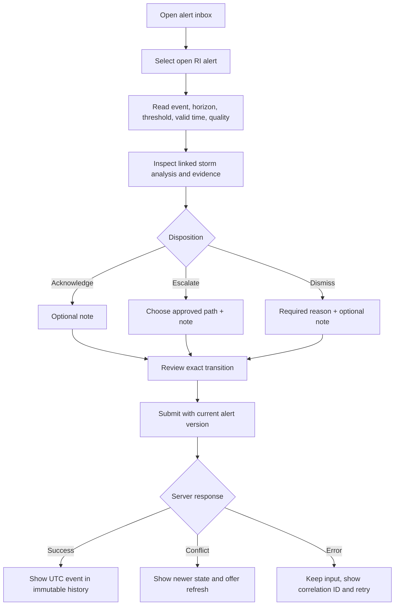
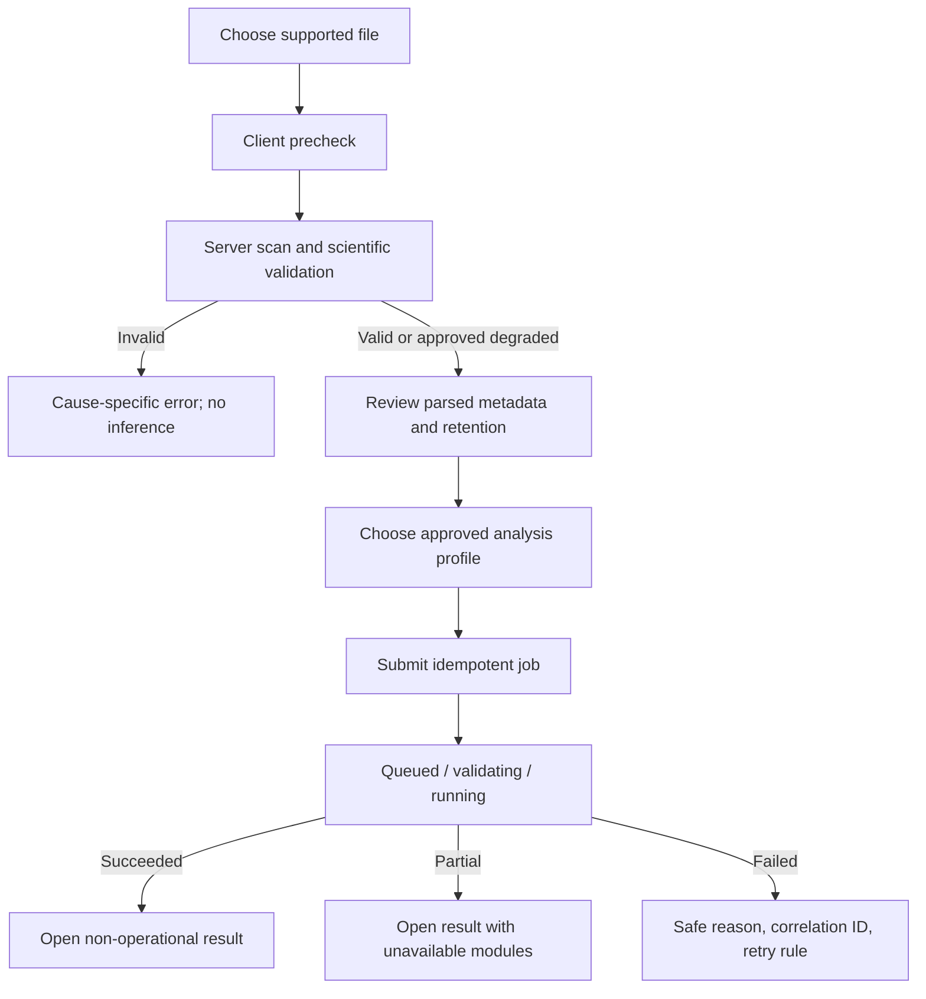

# UI/UX Specification

## Cyclone-AI analyst workspace

| Document field | Value |
|---|---|
| Document ID | CAI-UX-001 |
| Version | 1.0 |
| Status | Detailed design baseline; validation required with target users |
| Date | 23 August 2026 |
| Related documents | [PRD](PRD.md), [SRS](SRS.md), [Architecture](ARCHITECTURE.md) |
| Target accessibility | WCAG 2.2 Level AA for critical workflows |
| Primary form factor | Desktop analyst workstation; responsive critical read-only views |

> The demonstration MVP now implements the core overview, historical replay, image-analysis laboratory, data/model transparency, report, responsive, and degraded/qualification experiences described here. Administrative, institutional identity, persistent audit, complete alert inbox, multi-storm, and pilot workflows remain target designs. Meteorological labels, category policy, alert thresholds, and operating procedures still require review by qualified domain stakeholders.

---

## 1. UX purpose

Cyclone-AI’s interface must help an analyst answer five questions quickly and safely:

1. **What systems require attention now?**
2. **How current and complete are the observations?**
3. **What does the model estimate, and how uncertain is it?**
4. **What changed, and what is forecast at 6, 12, and 24 hours?**
5. **Where did this output come from, and how do I record my review?**

The interface is a decision-support workspace, not a public weather app. It prioritises status, time, evidence, uncertainty, and traceability over visual drama.

---

## 2. Research status and assumptions

### 2.1 Current evidence

This baseline is derived from the product and system requirements and common geospatial analytical workflows. It has **not yet been validated through contextual inquiry with IMD duty forecasters**. Therefore, layout, terminology, alert workload, and review actions are hypotheses.

### 2.2 Research questions

Before a controlled pilot, the team should observe or interview target users to answer:

- Which screen or bulletin is the starting point during a shift?
- Which values are compared before a Dvorak/intensity decision?
- What are the accepted category, wind, time, and uncertainty conventions?
- How often do users switch image channel/source and compare timestamps?
- What makes an RI signal actionable rather than distracting?
- Which states require acknowledgement, escalation, or annotation?
- What information is needed in a report and by whom?
- What display sizes, network limits, browsers, colour settings, and assistive technologies exist?
- Is dark mode preferred in operations rooms, and what contrast/ambient-light constraints apply?
- Which actions have legal or procedural significance?

### 2.3 Design hypotheses to test

1. Analysts prefer a map plus prioritised list on overview, not map-only discovery.
2. Storm detail should keep valid time and mode persistent while the user explores evidence.
3. A probability is useful only with threshold, horizon, trend, and data-quality context.
4. A compact provenance summary should be visible; full lineage belongs in a drawer/page.
5. Category ambiguity is better communicated as a range/adjacent labels than a single colour badge.
6. Historical replay should reuse storm-detail components while remaining unmistakably non-operational.

---

## 3. Users, needs, and permissions

### 3.1 User groups

| User | Primary needs | Common pressure |
|---|---|---|
| Duty forecaster | Prioritise systems, review current analysis, act on alerts | Time, multiple feeds, handover |
| Satellite analyst | Inspect imagery/structure, compare channels/times, validate centre | Visual detail and provenance |
| ML researcher | Replay, compare truth/models, inspect quality and manifests | Reproducibility and slicing |
| Administrator/SRE | Find stale feeds, failed jobs, model/runtime issues | Incident response and safe changes |
| Demonstration user | Understand a historical event and product value | Limited domain context |

### 3.2 Action matrix

Server-side access control is authoritative; the UI only reflects it.

| Action | Viewer | Analyst | Researcher | Administrator |
|---|:---:|:---:|:---:|:---:|
| View storms, analyses, alerts, provenance | ✓ | ✓ | ✓ | ✓ |
| Download permitted existing report | ✓ | ✓ | ✓ | ✓ |
| Record analysis review | — | ✓ | Optional by policy | ✓ |
| Transition alert status | — | ✓ | — | ✓ |
| Start historical analysis/replay | — | ✓ | ✓ | ✓ |
| Upload ad hoc input | — | ✓ | ✓ | ✓ |
| Generate report | — | ✓ | ✓ | ✓ |
| View full evaluation/model metadata | Summary | Summary | ✓ | ✓ |
| Change model/policy stage | — | — | Propose only | ✓ plus approval policy |
| Manage users/roles | — | — | — | Via approved identity/admin process |

Disabled controls should generally be hidden when the user cannot understand/use them. When discoverability matters (for example model metadata), a disabled control may show a concise permission explanation. The server must still enforce every denial.

---

## 4. Experience principles

1. **Time is always explicit.** Show valid time and `UTC`; do not use vague “recently” for analysis evidence.
2. **No-data is not no-risk.** Missing, stale, failed, and zero detections are visually and semantically different.
3. **Uncertainty is first-class.** Pair central estimates with interval/range and category ambiguity.
4. **Source and model are inspectable.** Provenance is close to every result, not buried in an admin page.
5. **Machine and human records are distinct.** Reviews never make the machine result look edited.
6. **Severity is redundant.** Use text, icon/shape, order, and accessible names in addition to colour.
7. **Progressive disclosure.** Default view answers operational questions; advanced science and raw metadata remain available.
8. **Safe state changes.** Explain consequence, require reasons where needed, confirm from server, and show audit outcome.
9. **Stable spatial context.** Filters and timeline changes should not unexpectedly reset map extent or image zoom.
10. **Consistent mode.** Historical, upload, shadow, and pilot contexts cannot be mistaken for one another.

---

## 5. Information architecture

### 5.1 Primary navigation

```text
Overview
Alerts
Storms
Historical analysis
Reports
Research                    (researcher/admin, when enabled)
System status               (all users see safe summary)
Administration              (admin only)
Help & terminology
```

### 5.2 Proposed routes

| Route | Screen | Notes |
|---|---|---|
| `/` or `/overview` | Operations overview | Default authenticated route |
| `/alerts` | Alert inbox | Deep-linkable filters |
| `/storms` | Storm/candidate directory | Active and historical search |
| `/storms/:stormId` | Storm detail | Defaults to latest available time |
| `/storms/:stormId/t/:validTime` | Time-addressable storm analysis | UTC timestamp encoded safely |
| `/history` | Historical event library | Search/select event |
| `/history/:stormId/replay` | Historical replay | Persistent non-operational mode |
| `/analysis/new` | Ad hoc analysis | Role gated |
| `/jobs/:jobId` | Analysis/report job status | Owner/role gated |
| `/reports` | Report library | Immutable revisions |
| `/research/models` | Model/evaluation catalogue | Researcher/admin |
| `/status` | Data and service status | Safe, non-secret diagnostics |
| `/admin/*` | Governed administrative workflows | Admin and approval controls |
| `/help` | Glossary, limitations, keyboard help | Contextual deep links |

URLs should preserve meaningful storm/time/filter context so users can share a deep link subject to authorisation. Sensitive tokens, signed URLs, filenames, and free text must not appear in URLs.

### 5.3 Global shell

**Header**

- product name and environment tag (`DEMO`, `SHADOW`, `PILOT`);
- global source-freshness summary;
- UTC clock (secondary; analysis valid time remains local to content);
- help/keyboard shortcuts;
- user menu with role and sign out.

**Left navigation (desktop)**

- labelled icons; collapsible but never icon-only without accessible labels/tooltips;
- unread/open alert count, capped display such as `99+`;
- active route indication not colour-only.

**Mode banner**

Appears below header on all analytical screens:

- `HISTORICAL — NOT OPERATIONAL`
- `USER-SUPPLIED ANALYSIS — NOT OPERATIONAL`
- `SHADOW MODE — MACHINE GUIDANCE`
- pilot-specific approved wording.

Banner stays visible while scrolling. It is included in screenshots/print/report output where feasible.

**Main content**

- page heading and one-sentence purpose;
- primary status/valid time;
- actions aligned consistently;
- breadcrumbs only for deeper administrative/research hierarchy, not as primary navigation.

---

## 6. Screen specifications

### 6.1 Sign-in and access states

#### Purpose

Authenticate through an institutional identity provider and communicate environment/mode before entry.

#### Content

- Cyclone-AI name and concise decision-support description.
- Environment label and non-official disclaimer for demo/shadow.
- `Sign in with <approved provider>` primary action.
- Links to acceptable-use/privacy/help statements.
- No provider credentials collected in a Cyclone-AI form when OIDC redirect is used.

#### States

- identity provider unavailable;
- session expired (preserve safe return path, never a pending state-changing form submission);
- authenticated but no role;
- access denied to a deep link;
- maintenance/degraded mode.

Error text includes a correlation ID and next step, not a stack trace.

---

### 6.2 Operations overview

#### User question

“What requires attention, and how trustworthy/current is the view?”

#### Desktop wireframe

```text
┌─────────────────────────────────────────────────────────────────────────────┐
│ Cyclone-AI   SHADOW   Data: DEGRADED · latest valid obs 14:30 UTC   User  │
├───────────┬─────────────────────────────────────────────────────────────────┤
│ Overview  │ SHADOW MODE — MACHINE GUIDANCE                                 │
│ Alerts  2 │ Operations overview                         Valid 14:30 UTC     │
│ Storms    │ ┌───────────────┐ ┌──────────────┐ ┌────────────────────────┐  │
│ History   │ │ 2 active      │ │ 1 open RI    │ │ INSAT delayed 18 min  │  │
│ Reports   │ │ systems       │ │ alert        │ │ View data status      │  │
│ Status    │ └───────────────┘ └──────────────┘ └────────────────────────┘  │
│           │ ┌──────────────────────────────────┬──────────────────────────┐ │
│           │ │ MAP: NIO                         │ PRIORITY QUEUE           │ │
│           │ │ candidates + tracks + freshness  │ 1. Storm A · RI review  │ │
│           │ │ [keyboard/list alternative]      │ 2. Candidate B · low cf │ │
│           │ │                                  │                          │ │
│           │ └──────────────────────────────────┴──────────────────────────┘ │
│           │ Active systems                                                   │
│           │ Name/status | valid time | Vmax + interval | 24 h | quality     │
└───────────┴─────────────────────────────────────────────────────────────────┘
```

#### Required content

1. **Freshness/status strip**
   - latest valid observation by operational source;
   - status `Current`, `Delayed`, `Stale`, `Unavailable`, or `Unknown`;
   - link to full status;
   - do not collapse all sources into “green” if a mandatory source is stale.

2. **Summary cards**
   - active known systems;
   - unmatched candidates awaiting review;
   - open/escalated alerts;
   - failed/partial analyses.

3. **Map**
   - NIO default extent;
   - known storms and candidates use different marker shapes and labels;
   - recent track and optional approved forecast/experimental geometry;
   - timestamp/source label for imagery layer;
   - accessible storm list mirrors every selectable marker.

4. **Priority queue**
   - sorted primarily by escalated/open alert severity and age, then data-quality attention, then latest change;
   - explain sorting in a `How priority is determined` popover;
   - not a hidden model-generated priority score unless separately governed.

5. **Active systems table/list**
   - name or candidate ID and lifecycle;
   - latest valid time and age;
   - estimated Vmax and interval;
   - category (including ambiguity);
   - 24-hour change/RI status;
   - DQ and analyst review status.

#### Interactions

- Map selection and table row selection synchronise.
- Clicking name opens storm detail; selecting a timestamp opens that exact analysis.
- Filters: known/candidate, basin, alert status, quality, valid-time age.
- Filters persist in URL during the session; a clear-all action is visible.
- User can switch `Cards + map` and `Table-focused` layout.

#### Critical states

- **No active known storms, feeds current:** say “No active tracked systems in the selected scope” and still show candidates/source status.
- **No current data:** say “Current system state is unknown because mandatory observations are stale/unavailable,” never “No cyclones.”
- **Partial API response:** show retained cards with per-panel errors and one correlation ID path.

---

### 6.3 Alert inbox

#### User question

“Which machine signals need review, and what has already been handled?”

#### Layout

- Heading with open/escalated count and last refresh time.
- Filter bar: state, type, severity, storm, valid-time range, model/rule version, assigned/reviewed by me (if assignment exists).
- Main table/list with expandable evidence summary.
- Detail opens in split panel on wide screens or separate route/dialog on small screens.

#### Alert row content

```text
[RI icon] Rapid-intensification threshold crossed          OPEN
Storm A · 24 h horizon · valid from 14:30 UTC
Probability 72% · trigger 65% · input quality VALID
Created 14:34 UTC · Rule ri-alert@1.3 · Not yet reviewed
```

Labels must distinguish probability from certainty. “72% RI probability” is acceptable; “RI will occur” is not.

#### Detail content

- exact trigger and threshold;
- base and forecast valid times;
- recent Vmax trend and interval;
- RI probability trend and calibration/model/rule versions;
- source freshness and missing features;
- linked image/analysis and provenance;
- prior related alerts/cooldown information;
- state history and reviewer actions.

#### Actions

- `Acknowledge` — confirms awareness; optional note.
- `Escalate` — requires destination/process if assignment is implemented.
- `Dismiss` — requires structured reason and optional note.
- `Resolve` — requires appropriate role and resolution reason.

State changes use a focused dialog that shows current state, intended new state, and permanence of the audit record. The client sends the currently viewed version; a concurrency conflict shows who changed it and offers refresh, never silent overwrite.

#### Suggested dismissal reasons

- source/data-quality issue;
- duplicate/related event;
- model artefact or implausible estimate;
- expected lifecycle transition;
- outside responsibility/scope;
- other (free text required).

These are research inputs, not ground-truth label changes.

---

### 6.4 Storm detail

#### User question

“What is happening with this system at this valid time, and why?”

#### Desktop layout

```text
┌────────────────────────────────────────────────────────────────────────────┐
│ SHADOW MODE — MACHINE GUIDANCE                                             │
│ ‹ Storms   PHAILIN / storm ID      [Known storm] [Quality: VALID]         │
│ Valid time 10 Oct 2013 12:00 UTC   Observation age: historical            │
├───────────────────────────────────┬────────────────────────────────────────┤
│ IMAGE / MAP workspace             │ ANALYSIS SUMMARY                       │
│ [IR source] [channel] [overlay]   │ Vmax 108 kt                            │
│                                   │ 90% interval 97–120 kt                  │
│ Original / explanation toggle     │ Extremely Severe CS                    │
│ Centre + bbox + track             │ Adjacent category possible: Super CS   │
│                                   │ Reviewed: Pending                       │
│ [zoom] [reset] [metadata]         │ [Record review] [Generate report]      │
├───────────────────────────────────┴────────────────────────────────────────┤
│ TIMELINE: observations · Vmax estimate + truth · forecasts · alerts       │
│ | 07 Oct | 08 Oct | 09 Oct | [10 Oct 12:00] | 11 Oct | ...               │
├───────────────────────────────────┬────────────────────────────────────────┤
│ 6 / 12 / 24 h forecast           │ RI probability                         │
│ values, intervals, persistence   │ 72% · threshold 65% · quality valid    │
├───────────────────────────────────┴────────────────────────────────────────┤
│ Evidence & environment | Provenance | Reviews | Related alerts             │
└────────────────────────────────────────────────────────────────────────────┘
```

#### Persistent header

- canonical storm name plus SID/aliases in secondary text;
- known storm vs unmatched candidate;
- lifecycle/status;
- selected valid time in unambiguous format with `UTC`;
- observation/analysis freshness and DQ;
- operating mode.

#### Image/map workspace

- Tabs or side-by-side modes: `Satellite`, `Map`, `Compare` (wide screens).
- Source/channel selector lists valid time, provider, and availability.
- Original image remains available when an explanation overlay is active.
- Overlay controls: detection geometry, centre source, recent track, explanation, grid/coordinates.
- Explanation legend states: “Highlights image regions associated with this model output; it does not prove causation.”
- Pixel-value/brightness-temperature inspection is P1 and keyboard accessible through focused coordinates/table where practical.
- Empty state differentiates `image missing`, `not licensed for display`, `failed to render`, and `no observation at selected time`.

#### Analysis summary

- central Vmax with `kt` attached;
- uncertainty interval and coverage, not an unexplained `±` value;
- category profile label/version available via details;
- ambiguity language when interval crosses boundaries;
- model status (`Approved for demo`, `Shadow candidate`, `Experimental`, as governed);
- analyst review state as a separate block.

Example:

> **108 kt** estimated maximum sustained wind<br>
> 90% interval: **97–120 kt**<br>
> Category range under profile `imd-review-profile@1.0`: **Extremely Severe to Super Cyclonic Storm**

#### Timeline and charts

- Shared crosshair/selected timestamp across imagery, map, and charts.
- Series are explicitly named: `Machine estimate`, `Selected reference`, `Persistence`, `Forecast issued <time>`.
- Uncertainty uses a band plus boundary lines/pattern; a text/table view is available.
- Missing observations create gaps, not zero-valued points.
- Reference truth is off or clearly separate during prospective-style review to avoid hindsight bias; historical demo may enable it explicitly.
- Event markers indicate alerts, analyst reviews, source changes, and landfall if approved data exist.
- Zoom has reset and keyboard controls; chart remains understandable without pointer hover.

#### Forecast panel

For each horizon:

- horizon and resulting valid time;
- resulting Vmax and/or change in kt;
- uncertainty interval;
- baseline comparison;
- input-history completeness;
- `insufficient data`, `degraded`, or `experimental` state as needed.

#### RI panel

- probability as number and bounded bar/gauge that is not colour-only;
- event definition in plain language, e.g. “Increase of at least 30 kt within 24 hours”;
- operating threshold and whether alert criteria passed;
- quality/freshness and model/calibration version;
- probability history when it supports interpretation.

#### Tabs/sections

1. **Evidence & environment** — approved environmental features, values/times/sources, missingness; explanatory visuals.
2. **Provenance** — concise lineage and link/download for manifest.
3. **Reviews** — immutable machine output followed by human review events.
4. **Related alerts** — alerts in chronological order and current status.

#### Record-review workflow

Actions: `Accept as useful`, `Needs attention`, `Do not accept`, with domain-approved wording. A review includes:

- selected structured disposition;
- optional/required reason based on disposition;
- optional note with character limit;
- statement that the original machine output is unchanged;
- submit/cancel and server confirmation.

A new review supersedes the user-facing “latest review” but prior events remain visible.

---

### 6.5 Historical event library and replay

#### Event library

Search/filter by:

- name/SID;
- basin;
- year/date range;
- peak category/intensity under a selected reference profile;
- source availability;
- dataset split (`train`, `validation`, `test`) visible only where appropriate to avoid test-set misuse;
- completed analysis/model version.

Results state source coverage and whether reference truth is available.

#### Replay setup

- event and bounded date range;
- source preference/channel;
- model version (approved options only; default is explicitly shown);
- reference overlay initially on/off according to use case;
- playback speed (manual, 0.5×, 1×, 2×, timestamp step);
- acknowledgement of historical/non-operational mode.

#### Replay controls

```text
[Previous observation] [Play/Pause] [Next observation]  Speed [1×]
07 Oct 12:00 ━━━━━━━●━━━━━━━━ 14 Oct 06:00 UTC
[ ] Show selected reference truth   [ ] Keep map centred on storm
```

- No autoplay before user starts.
- Pause on alert may be optional and defaults on for demonstrations.
- Skipped/missing cadence is shown as a time jump.
- Direct timestamp deep links are supported.
- A replay job that has not completed shows which timestamps are ready without implying later times have no result.

#### Historical comparison

- Machine vs selected reference values are visually and semantically separate.
- Error at a point may be shown only when reference source/revision/averaging period is visible.
- Aggregate metrics link to a full evaluation report and sample/storm counts.
- The interface warns when a storm belongs to a training/tuning set in researcher mode.

---

### 6.6 Ad hoc upload analysis

#### Step 1 — Select input

- Supported extensions/formats, compressed and uncompressed limit, expected channel/metadata.
- Drag-and-drop plus standard file picker; drop zone is not the only path.
- Display retention/deletion policy before selection.
- Filename is displayed safely and never treated as scientific metadata by itself.

#### Step 2 — Validate and review metadata

Show:

- detected format, dimensions/variables, size and checksum prefix;
- acquisition/valid time and timezone;
- source/satellite/channel if embedded;
- geospatial footprint/CRS;
- quality checks and limitations;
- editable declarations only for fields the workflow permits; user-supplied values are clearly labelled.

Errors distinguish unsupported file, malformed file, size/decompression limit, missing georeference, missing time, and scan failure. No analysis action is available until mandatory validation passes.

#### Step 3 — Configure analysis

- approved model/profile;
- expected mode fixed to `USER-SUPPLIED — NOT OPERATIONAL`;
- retention acknowledgement;
- estimated processing time and quota state;
- `Start analysis` button.

#### Step 4 — Job progress/result

Progress uses real server states (`Queued`, `Validating`, `Running`) rather than invented percentages unless stages provide measured progress. User can safely leave and return through job history. Failure includes safe reason, correlation ID, retry eligibility, and support path.

Uploads cannot create operational alerts by default.

---

### 6.7 Reports

#### Report library

- Report ID/title, storm, analysis valid time, generated time, template version, report revision, creator/service, mode, and status.
- Filters by storm/time/mode/template.
- Download permission and expiry are explicit.

#### Generate-report flow

1. Select immutable analysis/time range.
2. Preview included sources, quality warnings, reviews, and disclaimer.
3. Choose approved template/output.
4. Confirm generation.
5. Receive asynchronous job state and immutable report link.

#### Report content hierarchy

1. `Machine-generated — not an official forecast or warning` statement.
2. Storm/candidate identity, mode, issue time, and analysis valid time.
3. Source freshness and quality.
4. Current detection/intensity/category with uncertainty.
5. 6/12/24-hour intensity guidance and RI probability/event definition.
6. Image/map/chart with attribution.
7. Model, policy, source, and manifest identifiers.
8. Analyst review state and report revision.

Print CSS must preserve banner, legends, units, timestamps, source attribution, and page headings. Colour is supplemented by text/pattern in print.

---

### 6.8 System status

#### User question

“Can I trust this view to be current, and what is affected?”

#### Safe status for all users

- overall state: `Operational`, `Degraded`, `Major disruption`, `Maintenance`, or `Unknown`;
- source adapters with last successful **valid observation** and last successful **ingest** separately;
- analysis pipeline queue age and recent success state;
- model capability availability (detection/intensity/prediction), not infrastructure secrets;
- active incident/maintenance notice and affected capability;
- application and active model/policy versions at a safe level.

#### Admin detail

- job failures/retries/dead letters;
- worker/model readiness and resource saturation;
- object/database/queue dependencies;
- deploy revision and migration state;
- links to dashboards/runbooks/audit, based on role.

Status is not represented by a single green dot. A source can be current while prediction is unavailable; each capability exposes its own state and impact.

---

### 6.9 Research/model catalogue

For approved research/admin roles:

- model card: intended use, stage, version/digest, input signature, data manifest, code revision;
- metrics with storm/sample count, confidence interval, baseline, slices, and test-set status;
- calibration/reliability chart and confusion matrix where relevant;
- known limitations and excluded use;
- deployed environments and promotion history;
- compare up to two model versions without default cherry-picked axes;
- link to reproducibility/evaluation artefacts.

Promotion/rollback is an administrative workflow, not a casual toggle. It displays compatibility checks, affected capability/environment, approval requirement, and rollback target.

---

## 7. Common component specifications

### 7.1 Mode banner

| Property | Rule |
|---|---|
| Placement | Sticky below global header on analytical routes |
| Content | Mode name plus concise consequence |
| Visual | Distinct border/icon/text; colour supportive only |
| Accessibility | `role="status"` on initial route change without repeatedly interrupting users |
| Print/export | Included where context could otherwise be lost |

### 7.2 Freshness indicator

Must show:

- status word;
- latest valid time and UTC;
- age relative to configured threshold;
- source/capability scope;
- reason/impact for stale/unavailable state.

Do not show `Updated 2 min ago` alone. Example: `Delayed — latest valid INSAT observation 14:12 UTC (18 min old; threshold 15 min)`.

### 7.3 Intensity/category display

- Value and unit remain adjacent: `108 kt`.
- Interval includes coverage: `90% interval 97–120 kt`.
- Category label uses full name on first occurrence; approved abbreviation thereafter.
- Category colour is not used as a standalone severity scale.
- Boundary ambiguity uses explicit wording/range.
- Source/reference value never shares an unlabeled number with the model estimate.

### 7.4 Quality badge

| State | Label/icon concept | Behaviour |
|---|---|---|
| Valid | `Valid` + check | Details list passed/available checks on request |
| Degraded | `Degraded` + warning triangle | Always show reason and affected output |
| Invalid | `Invalid` + stop/octagon | Analysis blocked |
| Quarantined | `Quarantined` + lock/inbox | Admin/research detail only as authorised |
| Unknown | `Unknown` + question mark | Never treated as valid |

### 7.5 Provenance drawer

Summary fields:

- analysis ID/mode/base time;
- source provider/object ID/checksum prefix/valid time;
- adapter and preprocessing versions;
- model version and artefact digest prefix;
- category, RI, and alert rule versions;
- job/correlation IDs;
- DQ and warnings;
- `Download manifest` if authorised.

Long values have copy buttons with accessible confirmation. Full signed URLs and credentials are never displayed.

### 7.6 Toasts and notifications

- Toasts confirm noncritical completion but never contain the only record of a failure or alert.
- State-changing success: `Alert acknowledged at 14:41 UTC. View history.`
- Failure remains inline near the action and includes correlation ID.
- No rapidly disappearing toast for critical data staleness.
- `aria-live="polite"` for normal updates; reserve assertive announcements for user-triggered critical errors.

### 7.7 Dialogs

- Title states the action, not “Are you sure?”
- Body identifies object/current state/consequence.
- Primary button uses action verb (`Dismiss alert`), not `Yes`.
- Initial focus on title or safest relevant control; destructive action not pre-focused.
- Escape/cancel available unless processing makes cancellation unsafe.
- Focus returns to invoker after close.

### 7.8 Tables

- Real semantic table for tabular data; sticky header on long desktop lists.
- Sort state included in accessible name and URL when shareable.
- Row action menus are keyboard accessible.
- Mobile table becomes labelled cards without dropping units/times/status.
- Empty table says whether no records exist or filters excluded them.

---

## 8. Data visualisation guidelines

### 8.1 Maps

- Provide equivalent selectable storm list and coordinate/track table.
- Markers use shape + label + optional colour.
- Known storms, unmatched candidates, selected storm, and forecast points are distinguishable in monochrome.
- Legend is visible and keyboard reachable.
- Layer control includes source and valid time.
- Display uncertainty cone/band only if method is documented; no decorative cone.
- Avoid red/green-only status.
- Preserve user extent when toggling layers; offer explicit `Fit to storm`/`Reset to NIO`.
- Attribution is always visible and included in exports.
- If map tiles fail, analytical table and status remain usable.

### 8.2 Time-series charts

- X-axis timezone explicitly UTC.
- Y-axis includes `Vmax (kt)` and does not change scale unexpectedly during playback; user-controlled scale reset is available.
- Missing data are gaps.
- Estimate and reference use different line style in addition to colour.
- Uncertainty bands are labelled in legend and text alternative.
- Forecast lines start at issuance/base time and distinguish different forecast vintages.
- Tooltip is supplemental; selected-point values are visible in an accessible details region/table.
- Offer `View as table` and downloadable accessible data where authorised.

### 8.3 Probability

- Use percentage and decimal consistently within a screen (prefer percentage for users, decimal in API).
- State event and horizon next to value.
- Show threshold as a labelled marker, not hidden in tooltip.
- Do not use speedometer-style gauges that imply unwarranted precision.
- Calibration status/limitations are available through details.

### 8.4 Images and overlays

- Preserve original aspect ratio and document any projection/resampling.
- Always offer original image without saliency/detection overlay.
- Legends identify channel, units/scale, source, and valid time.
- Do not use a rainbow colour map for scalar fields; choose perceptually ordered and colour-vision-aware palettes.
- Animation controls include pause, manual stepping, speed, and reduced-motion behaviour.

---

## 9. Visual design system

### 9.1 Tone

Professional, calm, technical, and compact. Avoid disaster imagery, pulsing alarm effects, glassmorphism, ornamental gradients, or language that exaggerates model certainty.

### 9.2 Foundations

**Typography**

- UI sans serif with high legibility at dense sizes; system font stack is acceptable.
- Monospaced font only for IDs, checksums, and structured technical values.
- Base body target 16 px; dense tables may use 14 px only with adequate line height and user testing.
- Do not encode hierarchy by size alone; use semantic headings.

**Spacing**

- 4 px base grid; common spacing 8, 12, 16, 24, 32 px.
- Touch/click targets target at least 44 × 44 CSS px for primary controls; dense desktop exceptions require adequate separation and accessibility review.

**Shape**

- Modest radii; borders and spacing establish grouping.
- Alert/state icons have distinct silhouettes.
- Avoid category semantics based solely on badge shape or colour.

### 9.3 Proposed colour tokens

Exact values must pass automated and manual contrast checks in the implemented theme.

| Token | Proposed use |
|---|---|
| `surface/base` | Primary page background |
| `surface/raised` | Panels and dialogs |
| `text/primary`, `text/muted` | Text hierarchy with required contrast |
| `border/default`, `border/strong` | Grouping and focus adjacency |
| `action/primary` | Primary interactive controls only |
| `status/info` | Context, historical mode |
| `status/warning` | Degraded data or attention |
| `status/critical` | Critical/open escalation, never alone |
| `status/success` | Completed/valid, never equivalent to “no risk” |
| `focus/ring` | High-contrast keyboard focus independent of status colours |
| `chart/series-*` | Colour-vision-tested series plus dash/marker differences |

Category colours, if stakeholders require familiar mapping, are secondary accents. Every category chip includes text, and charts offer shape/pattern distinctions. “Valid” green must not be interpreted as meteorological safety.

### 9.4 Dark theme

Dark theme is optional, not assumed. If implemented, it is a fully tested token set rather than colour inversion. Satellite imagery, chart contrast, map labels, focus states, and status semantics require operational-room testing. Respect operating-system preference but retain a user override.

---

## 10. Content design and terminology

### 10.1 Voice

- Concise and factual.
- Use calibrated language: `estimated`, `candidate`, `probability`, `machine guidance`, `data unavailable`.
- Avoid `safe`, `all clear`, `confirmed`, `will`, or `accurate` unless an authoritative human/system specifically supplies that status.
- Explain the consequence of an error and next step.

### 10.2 Preferred terms

| Prefer | Avoid | Reason |
|---|---|---|
| `Valid time 14:30 UTC` | `As of now` | Precise and replay-safe |
| `Candidate system` | `Cyclone detected` | Avoids confirmation claim |
| `Estimated Vmax 65 kt` | `Wind is 65 kt` | Distinguishes model output |
| `RI probability 72%` | `72% confidence` | Names the predicted event |
| `Insufficient history for 24 h guidance` | `No prediction` | Explains why and scope |
| `Latest observation is stale` | `Offline` | Distinguishes data from service |
| `Machine-generated, non-official` | `AI forecast` alone | Safety and authority |
| `Selected reference source` | `Ground truth` without qualification | Best-track sources can be revised/differ |

### 10.3 Date/time formatting

Primary analytical format:

```text
23 Aug 2026, 14:30 UTC
```

Use four-digit year and explicit `UTC`. In dense charts, abbreviated ticks are permitted only when full time is available in selection/details. Relative age can supplement but not replace absolute valid time.

### 10.4 Numbers and units

- Wind: `108 kt`; optional approved conversion in details, never unlabeled.
- Coordinates: hemisphere or signed decimal convention used consistently; API remains signed decimal.
- Probability: round to a user-tested precision, typically whole percent; retain full API value.
- Missing value: `Not available`, `Not observed`, or `Not produced` according to cause—not `0`, `--` without legend, or blank.
- Use en dash for ranges: `97–120 kt`.

### 10.5 Disclaimers

Short persistent version:

> Machine guidance for analysis support. Not an official forecast or public warning.

Historical version:

> Historical replay — not operational. Reference observations may include later revisions.

Longer report and first-use language is approved with programme/domain stakeholders. A disclaimer does not compensate for misleading labels or unsafe workflow.

---

## 11. System states and feedback

Every major panel defines the following:

| State | Required behaviour |
|---|---|
| Initial/loading | Skeleton matching expected layout; accessible loading label; preserve stable prior content if refreshing |
| Empty | State what is empty and why/which filters; offer next action |
| Zero result | Explicit valid result such as `No candidates above approved threshold in this valid scene`; include scene/time/quality |
| Stale | Preserve last-known content, show valid time/age/threshold and affected actions |
| Partial | Render available modules and list unavailable ones/reasons |
| Invalid/quarantined | Do not show inference as successful; explain validation status based on role |
| Error | Safe message, affected scope, retry eligibility, correlation ID, support/status link |
| Unauthorised | Explain required access or return path; do not leak resource existence/details |
| Offline/browser network loss | Label content as last displayed; block state changes until server confirmation |
| Updating | Keep context, announce update, prevent duplicate submit |

### 11.1 Refresh behaviour

- Overview may poll or receive server events, but changes do not steal focus or reorder a list while the user is interacting without notice.
- Show `New updates available` with an apply action when reordering would disrupt review.
- Storm detail at a historical timestamp does not jump to latest automatically.
- `Follow latest` is explicit and reversible.

### 11.2 Optimistic UI

Do not optimistically finalise alert/review/model transitions. Show a submitted state and wait for authoritative server response. Idempotency protects retry after network interruption.

---

## 12. Responsive behaviour

### 12.1 Breakpoint intent

Use content-driven breakpoints rather than device names; likely ranges:

- compact: `< 640 px`;
- medium: `640–1023 px`;
- wide: `≥ 1024 px`;
- analyst wide: `≥ 1440 px` optional enhanced split view.

### 12.2 Compact layout

- Header compresses but retains environment/mode and freshness access.
- Navigation becomes a labelled drawer; active alert count remains accessible.
- Overview defaults to priority list; map is a secondary full-width panel.
- Storm detail stacks summary, image/map, timeline, forecast, evidence.
- Tables become labelled cards without hiding times/units/quality.
- Complex model administration may be read-only or direct users to desktop if it cannot be made safe; critical review remains supported if mobile is approved.

### 12.3 Wide layout

- Map/list and image/summary split panels.
- User-resizable panels with reset; resizing remains keyboard accessible or an alternative fixed layout is offered.
- Maximum line length on prose/detail panels; data visualisations may use full width.

### 12.4 Zoom/reflow

At 200% browser zoom, content reflows without two-dimensional page scrolling except inherently two-dimensional maps/charts/tables, which receive contained scrolling and alternatives. Sticky elements must not consume most of the viewport.

---

## 13. Accessibility specification

### 13.1 Semantic structure

- One clear `h1` per route and hierarchical headings.
- Landmarks: header, navigation, main, complementary where useful.
- Skip link to main content and optional skip to active alert/storm list.
- Native buttons/links/inputs before custom widgets.
- Accessible names include purpose and current state, not duplicate visible noise.

### 13.2 Keyboard

- Logical focus follows visual/task order.
- Highly interactive maps/charts do not trap arrows/tab; provide instructions and exit.
- Shortcuts are optional, discoverable, remappable/disableable where single-key, and never required.
- Dialog focus is contained and restored.
- Timeline can be operated with standard slider or button patterns and has explicit previous/next controls.

### 13.3 Screen readers

- Dynamic job/refresh updates announce concise status, not every animation frame.
- Chart has summary, selected values, and data table.
- Map marker information is mirrored in a list.
- Status badges expose text.
- Icon-only controls have labels; decorative icons are hidden.
- Probability and uncertainty are read as complete phrases.

### 13.4 Vision and colour

- Text contrast targets WCAG AA (4.5:1 normal text, 3:1 large text); non-text UI/focus indicators target 3:1 as applicable.
- Focus ring is visible on all backgrounds.
- Charts/markers use line style, shape, labels, and patterns.
- Browser/system high-contrast and forced-colour modes are tested.
- User text scaling does not truncate critical values.

### 13.5 Motion and timing

- Respect reduced-motion preference.
- Replay starts only on user command and can pause.
- No flashing content.
- Sessions warn before expiry and allow extension where identity policy permits.
- Time-limited signed download expiry is communicated and refreshable without data loss.

### 13.6 Test matrix

At minimum:

- automated axe-compatible checks in component and route CI;
- keyboard-only completion in Chromium and Firefox;
- NVDA + Firefox/Chrome on Windows target environment;
- one additional approved screen reader/browser combination;
- 200% and 400% zoom/reflow checks for critical pages;
- Windows forced-colours/high-contrast;
- colour-vision simulation plus human review;
- PDF/report reading order and text extraction.

Automated checks are necessary but not sufficient.

---

## 14. Interaction flows

### 14.1 Review an RI alert



### 14.2 Analyse an upload



### 14.3 Change selected valid time

1. User selects a timestamp from timeline/previous-next.
2. URL updates and mode remains fixed.
3. Existing content remains with updating state until new analysis resolves.
4. All panels update atomically where possible; otherwise each declares its timestamp and partial state.
5. Focus remains at timeline/selecting control unless user requests jump to summary.
6. Screen reader receives one concise announcement: storm, selected valid time, result status.

No panel may show data from a different timestamp without an explicit local timestamp.

---

## 15. Design validation plan

### 15.1 Formative usability study

Recruit, subject to access:

- 4–6 meteorological/satellite analysts;
- 2–3 ML/research users;
- 2 SRE/admin users;
- accessibility participants or expert review appropriate to target environment.

Core tasks:

1. Identify the system requiring most attention on a degraded-data overview.
2. Determine latest valid observation and affected source.
3. Interpret an intensity interval crossing a category boundary.
4. Review and dismiss an RI alert with a reason.
5. Compare machine estimate with a selected historical reference.
6. Find model/source/preprocessing versions for one result.
7. Recover from a failed upload and locate correlation ID.
8. Determine whether a prediction is unavailable or predicts no change.

Measure:

- task completion and critical errors;
- time on task (diagnostic, not sole success criterion);
- misinterpretation of mode, time, probability, and uncertainty;
- alert disposition confidence/reasoning;
- provenance discoverability;
- System Usability Scale or another lightweight benchmark, supplemented by qualitative findings.

### 15.2 Safety-focused comprehension checks

Participants should correctly answer:

- Is this an official forecast?
- What timestamp does the estimate represent?
- Is 72% the model’s “confidence” in the wind value or probability of a defined RI event?
- What does an interval crossing a category boundary mean?
- Does no current detection mean current data were available and valid?
- Did an analyst review change the original machine output?

Any systematic error blocks pilot readiness regardless of visual preference scores.

### 15.3 Iteration gates

- **Wireframe gate:** navigation and task sequence validated.
- **Content gate:** domain terminology, units, alerts, and disclaimer approved.
- **Prototype gate:** interactive states, keyboard flow, responsive layout tested.
- **Integrated gate:** real latencies/errors/partial data and role permissions tested.
- **Shadow gate:** workload, alert fatigue, handover, and incident behaviour observed.

---

## 16. Product analytics and feedback

Telemetry is optional and subject to deployment approval. Prefer privacy-preserving first-party events:

- page/feature used at aggregate level;
- time to open linked evidence from an alert;
- review completion/abandonment and structured reason counts;
- filter/empty/error occurrence;
- report generation outcome;
- accessibility preference such as reduced motion only when needed locally, not as identity profiling.

Do not send storm content, filenames, free-text notes, tokens, signed URLs, personal identifiers, or precise user behaviour to third-party analytics. Operational/audit events are not product analytics and have separate retention/access.

Provide in-product feedback tied to route, safe application version, and optional user comment. Never attach source imagery or scientific data without explicit user approval and policy.

---

## 17. UI acceptance checklist

### Global

- [ ] Environment and operating mode are persistent and unambiguous.
- [ ] All analysis values show valid time and UTC; update/ingest time is distinct.
- [ ] Machine-generated/non-official status is clear.
- [ ] Missing, stale, zero, invalid, partial, and error states are distinct.
- [ ] Browser calls use relative URLs and function behind the deployment proxy.
- [ ] Role-gated actions are enforced by the server and represented clearly.

### Scientific communication

- [ ] Wind values include units and approved averaging/source detail.
- [ ] Intervals state coverage and category boundary ambiguity.
- [ ] RI probability includes event definition, horizon, threshold, and quality.
- [ ] Model/reference/analyst values are never conflated.
- [ ] Explanation overlays are optional and labelled non-causal.
- [ ] Experimental track guidance is visually/semantically distinct.

### Accessibility

- [ ] Critical tasks are complete by keyboard.
- [ ] Map/chart alternatives are available.
- [ ] Colour is not the only signal.
- [ ] Focus and dynamic announcements work.
- [ ] 200% zoom and compact reflow preserve critical content.
- [ ] Automated and manual assistive-technology checks pass.

### Reliability and feedback

- [ ] Poll/refresh never silently changes selected historical time.
- [ ] Failed transitions preserve form input and expose correlation ID.
- [ ] Concurrency conflict is visible and cannot overwrite another review.
- [ ] Job states come from the server; no false progress percentage.
- [ ] Source outage cannot look like no cyclone/no alert.

### Reports

- [ ] Disclaimer, mode, issue/valid time, versions, units, quality, and attribution survive print/export.
- [ ] Report revisions are immutable and linked.
- [ ] PDF reading order and contrast are checked.

---

## 18. Open UX decisions

1. Exact terminology and workflow for analyst review dispositions.
2. Whether and how duty-shift handover/assignment is represented.
3. Approved alert severity levels and audio/desktop notification policy.
4. Default truth-overlay behaviour in historical evaluation to avoid hindsight bias.
5. Whether source/channel comparison is tabs, swipe, or side-by-side for target monitors.
6. Whether dark theme is required in the operations room.
7. Approved category colour conventions, if any, and print/monochrome equivalent.
8. Which environmental features are useful enough for the default view.
9. Which reports mirror an existing institutional format and which are purely project reports.
10. Mobile/tablet role in the approved workflow.
11. Language/localisation requirements beyond English.
12. Map/tile source and restricted-network behaviour.

---

## 19. Design handoff deliverables

Before frontend implementation is considered complete, the design package should include:

- responsive Figma or equivalent source with reusable components/tokens;
- all major routes and all system states, not only success screens;
- interaction annotations and role visibility;
- content glossary and approved disclaimers;
- chart/map legends and accessible alternatives;
- keyboard/focus order and screen-reader notes;
- sample realistic datasets including long names, missing values, ambiguity, multiple alerts, and degraded sources;
- component acceptance stories/test IDs linked to SRS requirements;
- export/print layouts; and
- record of user/domain/accessibility validation and unresolved issues.

---

## 20. Approval record

| Role | Decision | Name/date |
|---|---|---|
| Product owner | Pending | — |
| UX lead | Pending | — |
| Meteorological reviewer | Pending | — |
| Frontend lead | Pending | — |
| Accessibility reviewer | Pending | — |
| Security/privacy reviewer | Pending | — |
